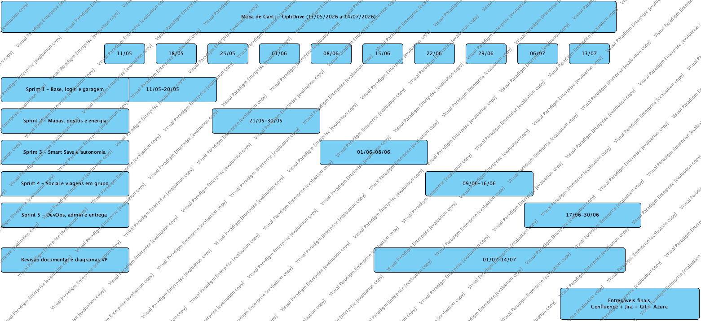
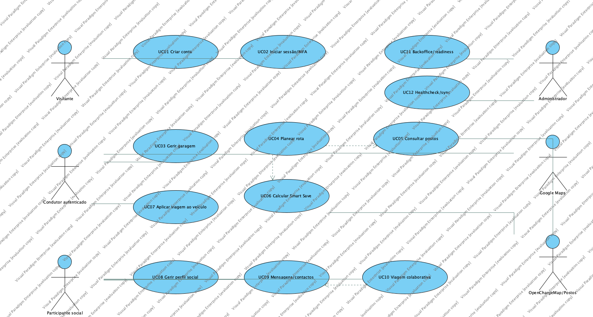

# OptiDrive - Análise e Especificação de Requisitos

| Campo | Valor |
| --- | --- |
| Unidade curricular | Engenharia de Software Aplicada |
| Projeto | OptiDrive |
| Documento | Análise e Especificação de Requisitos |
| Template base | Template - Análise e Especificação de Requisitos |
| Versão | 3.0 |
| Data | 08/07/2026 |
| Autor | Alexandre Miguel |

## Versões do Trabalho

| Versão | Data | Autor | Descrição |
| --- | --- | --- | --- |
| 1.0 | 11/05/2026 | Alexandre Miguel | Primeira análise enviada para validação docente |
| 2.0 | 30/06/2026 | Alexandre Miguel | Consolidação da entrega final |
| 3.0 | 08/07/2026 | Alexandre Miguel | Versão oficial segundo templates e normas dos slides |

## 1. Introdução

### 1.1 Missão

O OptiDrive tem como missão apoiar condutores no planeamento de viagens, juntando garagem, autonomia, custos, postos de combustível, carregadores elétricos e componente social numa única aplicação web. O objetivo é reduzir incerteza operacional antes da viagem e melhorar a decisão durante o planeamento.

### 1.2 Ponto de situação

O sistema encontra-se implementado em ASP.NET Core MVC/.NET 8, com persistência SQLite/EF Core, Docker, autenticação local, MFA, rotas, garagem, Smart Save, social, administração e integrações configuráveis. Esta versão organiza a documentação para ficar alinhada com os templates oficiais e com as normas de BPMN/UML.

## 2. Documentação do projeto

| Fase | Documento |
| --- | --- |
| Requisitos | Análise e Especificação de Requisitos |
| Desenho | Desenho de Alto Nível |
| Implementação incremental | Desenho Detalhado Sprint 1 a 5 |
| Gestão | Atas Sprint 1 a 5, Project Manager, Métricas |
| Qualidade | Plano de Testes e Gestão de Erros |
| Encerramento | Documento de Encerramento do Projeto |

### 2.1 Histórico e Motivação

#### 2.1.1 Origem histórica do projeto

A ideia surge da necessidade de planear deslocações com maior controlo sobre custos, autonomia e disponibilidade de postos ou carregadores. A mobilidade atual exige conciliar veículos a combustão, elétricos e híbridos, preços variáveis, portagens e viagens partilhadas.

#### 2.1.2 Qual o problema a ser resolvido?

O problema principal é a falta de ligação entre dados do veículo, rota real, autonomia, custo e rede de abastecimento. Muitas ferramentas calculam rotas, mas não associam diretamente a viagem ao estado operacional de um veículo concreto nem ao histórico da garagem.

#### 2.1.3 Quais as abordagens para a resolução do problema?

Foram consideradas três abordagens: aplicação apenas de rotas, aplicação apenas de garagem e produto integrado. A abordagem escolhida foi produto integrado, pois permite que o planeamento use dados reais do veículo e alimente o histórico após a viagem.

## 3. Plano de Projeto

### 3.1 Sumário da metodologia

Foi usada uma abordagem incremental inspirada em Scrum, dividida em cinco sprints. A aplicação das práticas foi adaptada à realidade do projeto, mantendo backlog, prioridades MoSCoW, atas, retrospetivas e validação por incremento.

### 3.2 Equipa de desenvolvimento

| Papel | Responsável | Responsabilidades |
| --- | --- | --- |
| Product Owner académico | Alexandre Miguel | Visão, requisitos, prioridades e validação funcional |
| Scrum Master | Alexandre Miguel | Planeamento, atas, backlog, riscos e impedimentos |
| Desenvolvimento full-stack | Alexandre Miguel | ASP.NET Core MVC, Razor, JavaScript, CSS, EF Core, Docker |
| Qualidade e documentação | Alexandre Miguel | Testes, relatórios, Confluence, Jira e validação |
| Stakeholder académico | Docente | Feedback, critérios de avaliação e validação dos entregáveis |

### 3.3 Ferramentas

| Ferramenta | Utilização |
| --- | --- |
| ASP.NET Core MVC / .NET 8 | Implementação web principal |
| Razor Views, JavaScript e CSS | Interface, mapas, interação e internacionalização |
| EF Core + SQLite | Persistência local e ambiente Docker |
| Docker Compose | Execução reproduzível |
| Google Maps APIs | Geocoding, mapas e direções |
| OpenChargeMap | Carregadores elétricos |
| Jira | Backlog, sprints e tarefas |
| Confluence | Publicação dos relatórios |
| Git/GitHub | Controlo de versões e entrega do código |

### 3.4 Controlo de versões

O código está estruturado em solução .NET com projetos separados para aplicação e testes. A documentação é guardada numa pasta própria para controlo de versão, revisão e publicação no Confluence.

### 3.5 Estrutura do projeto - Planeamento de Alto Nível

| Sprint | Nome | Início | Fim | Módulos | Entregável |
| --- | --- | --- | --- | --- | --- |
| 1 | Identidade, Segurança e Garagem | 11/05/2026 | 20/05/2026 | M01, M02 | Login local, MFA, sessão, garagem base e histórico inicial |
| 2 | Mapas, Postos e Energia | 21/05/2026 | 30/05/2026 | M03, M04 | Google Maps, rotas, postos de combustível e carregadores EV |
| 3 | Smart Save e Histórico Operacional | 01/06/2026 | 08/06/2026 | M02, M05 | Consumo por velocidade, autonomia, reforços, aplicar viagem ao veículo |
| 4 | Social, OAuth e Viagens Colaborativas | 09/06/2026 | 16/06/2026 | M01, M06 | Perfis sociais, contactos, mensagens, viagens em grupo e autenticação externa |
| 5 | DevOps, Administração e Entrega Final | 17/06/2026 | 30/06/2026 | M07 | Docker, Azure, backoffice, i18n, tema, métricas e documentação |

*Figura 1 - Gantt.*

## 4. Especificação dos requisitos do software

### 4.1 Módulos

| ID | Módulo | Descrição |
| --- | --- | --- |
| M01 | Identidade e Segurança | Login local, OAuth, sessão, MFA TOTP, recovery codes e perfis de acesso |
| M02 | Garagem e Veículos | Gestão de veículos, autonomia, combustível/carga, manutenção e histórico |
| M03 | Planeamento Inteligente | Rotas, origem/destino, waypoints opcionais, itinerário e portagens |
| M04 | Postos e Energia | Postos de combustível, carregadores EV, filtros por marca, energia e proximidade |
| M05 | Smart Save e Autonomia | Consumo por velocidade, custo estimado, reforços e reserva de chegada |
| M06 | Social e Viagens Colaborativas | Perfis, contactos, mensagens, grupos, viagens partilhadas e split de custos |
| M07 | Administração e Observabilidade | Backoffice, sincronizações, healthcheck, Docker, i18n e tema |

### 4.2 Requisitos

Legenda MoSCoW: Must = obrigatório; Should = importante; Could = desejável; Won't = fora do âmbito atual.

| ID | Módulo | Prioridade | Requisito |
| --- | --- | --- | --- |
| RF-M01-01 | M01 | Must | O sistema deverá permitir criar conta local com nome, email e palavra-passe. |
| RF-M01-02 | M01 | Must | O sistema deverá autenticar utilizadores locais com hash seguro de palavra-passe. |
| RF-M01-03 | M01 | Must | O sistema deverá permitir iniciar sessão e terminar sessão de forma segura. |
| RF-M01-04 | M01 | Should | O sistema deverá permitir autenticação externa por Google e Microsoft quando configurada. |
| RF-M01-05 | M01 | Should | O sistema deverá permitir ativar MFA TOTP por aplicação Authenticator compatível. |
| RF-M01-06 | M01 | Should | O sistema deverá disponibilizar códigos de recuperação para MFA. |
| RF-M02-01 | M02 | Must | O sistema deverá permitir criar, editar, consultar e remover veículos da garagem. |
| RF-M02-02 | M02 | Must | O sistema deverá associar marca, modelo, ano, combustível, consumo e matrícula a cada veículo. |
| RF-M02-03 | M02 | Must | O sistema deverá registar o nível atual de combustível ou carga de cada veículo. |
| RF-M02-04 | M02 | Should | O sistema deverá permitir registar abastecimentos ou carregamentos e atualizar o histórico. |
| RF-M02-05 | M02 | Should | O sistema deverá refletir viagens aplicadas no nível e histórico do veículo. |
| RF-M03-01 | M03 | Must | O sistema deverá permitir planear rota com origem e destino escritos pelo utilizador. |
| RF-M03-02 | M03 | Should | O sistema deverá permitir pontos intermédios opcionais, sem os tornar obrigatórios. |
| RF-M03-03 | M03 | Must | O sistema deverá apresentar mapa, rota visual, distância, duração e instruções. |
| RF-M03-04 | M03 | Should | O sistema deverá recalcular rota quando o utilizador seleciona evitar portagens. |
| RF-M03-05 | M03 | Must | O sistema deverá apresentar custo estimado total da viagem. |
| RF-M04-01 | M04 | Must | O sistema deverá consultar e apresentar postos de combustível disponíveis. |
| RF-M04-02 | M04 | Should | O sistema deverá agregar combustíveis e preços por posto quando existirem dados disponíveis. |
| RF-M04-03 | M04 | Must | O sistema deverá consultar e apresentar carregadores elétricos via OpenChargeMap. |
| RF-M04-04 | M04 | Should | O sistema deverá filtrar postos por marca e por combustível/energia compatível com o veículo. |
| RF-M04-05 | M04 | Should | O sistema deverá privilegiar postos próximos da rota calculada. |
| RF-M05-01 | M05 | Must | O sistema deverá estimar consumo com base no veículo, distância e energia utilizada. |
| RF-M05-02 | M05 | Should | O sistema deverá ajustar consumo previsto de acordo com velocidade média. |
| RF-M05-03 | M05 | Must | O sistema deverá verificar se a autonomia disponível chega ao destino. |
| RF-M05-04 | M05 | Must | O sistema deverá sugerir reforços de combustível ou carga quando a autonomia for insuficiente. |
| RF-M05-05 | M05 | Should | O sistema deverá garantir margem mínima de chegada, evitando estimativas de chegada a zero. |
| RF-M06-01 | M06 | Must | O sistema deverá permitir manter perfil social com nome, fotografia, cidade e preferências. |
| RF-M06-02 | M06 | Must | O sistema deverá permitir pesquisar utilizadores e solicitar ligação social. |
| RF-M06-03 | M06 | Must | O sistema deverá permitir trocar mensagens entre utilizadores ligados. |
| RF-M06-04 | M06 | Should | O sistema deverá permitir criar viagens colaborativas com participantes. |
| RF-M06-05 | M06 | Could | O sistema deverá permitir dividir custos estimados entre participantes. |
| RF-M07-01 | M07 | Must | O sistema deverá disponibilizar backoffice para estado de integrações e utilizadores. |
| RF-M07-02 | M07 | Must | O sistema deverá disponibilizar endpoint de saúde operacional. |
| RF-M07-03 | M07 | Should | O sistema deverá disponibilizar modo claro/escuro e português/inglês. |
| RF-M07-04 | M07 | Must | O sistema deverá executar em Docker com base de dados persistente. |

### 4.3 Atores

| ID | Ator | Tipo | Descrição |
| --- | --- | --- | --- |
| A01 | Visitante | Humano | Pessoa que ainda não iniciou sessão |
| A02 | Condutor autenticado | Humano | Utilizador principal que gere veículos e rotas |
| A03 | Participante social | Humano | Utilizador que participa em mensagens ou viagens colaborativas |
| A04 | Administrador | Humano | Utilizador com acesso ao backoffice e monitorização |
| A05 | Google Maps | Sistema externo | Serviço de geocoding, mapas e direções |
| A06 | OpenChargeMap/Postos | Sistema externo | Fontes de carregadores e informação energética |
| A07 | Fornecedor OAuth | Sistema externo | Google/Microsoft para login externo configurável |

### 4.4 Use Cases

*Figura 2 - Diagrama geral de use cases.*

| ID | Use Case | Atores | Requisitos rastreados |
| --- | --- | --- | --- |
| UC-01 | Criar conta local | Visitante | RF-M01-01, RF-M01-02 |
| UC-02 | Iniciar sessão/MFA | Visitante, Condutor autenticado | RF-M01-03, RF-M01-04, RF-M01-05, RF-M01-06 |
| UC-03 | Gerir garagem | Condutor autenticado | RF-M02-01, RF-M02-02, RF-M02-03 |
| UC-04 | Registar abastecimento/carga | Condutor autenticado | RF-M02-04 |
| UC-05 | Planear rota | Condutor autenticado, Google Maps | RF-M03-01, RF-M03-02, RF-M03-03, RF-M03-04, RF-M03-05 |
| UC-06 | Consultar postos/carregadores | Condutor autenticado, OpenChargeMap/Postos | RF-M04-01, RF-M04-02, RF-M04-03, RF-M04-04, RF-M04-05 |
| UC-07 | Calcular Smart Save | Condutor autenticado | RF-M05-01, RF-M05-02, RF-M05-03, RF-M05-04, RF-M05-05 |
| UC-08 | Aplicar viagem ao veículo | Condutor autenticado | RF-M02-05, RF-M05-01 |
| UC-09 | Gerir perfil social | Condutor autenticado | RF-M06-01 |
| UC-10 | Solicitar ligação social | Condutor autenticado, Participante social | RF-M06-02 |
| UC-11 | Enviar mensagem | Condutor autenticado, Participante social | RF-M06-03 |
| UC-12 | Criar viagem colaborativa | Condutor autenticado, Participante social | RF-M06-04, RF-M06-05 |
| UC-13 | Consultar backoffice | Administrador | RF-M07-01 |
| UC-14 | Consultar healthcheck | Administrador | RF-M07-02 |
| UC-15 | Alterar tema/idioma | Condutor autenticado | RF-M07-03 |

### 4.5 Descrição resumida dos Use Cases críticos

| Use Case | Pré-condição | Fluxo principal | Pós-condição |
| --- | --- | --- | --- |
| UC-03 Gerir garagem | Utilizador autenticado | Criar veículo, preencher dados, guardar e consultar ficha | Veículo fica associado ao utilizador |
| UC-05 Planear rota | Existe veículo selecionado | Inserir origem/destino, calcular rota, ver mapa e custos | Rota fica pronta para guardar/aplicar |
| UC-07 Calcular Smart Save | Rota e veículo válidos | Estimar consumo, custos, autonomia e reforços | Utilizador recebe recomendação de viagem |
| UC-12 Criar viagem colaborativa | Perfil social ativo | Definir viagem, convidar participantes e iniciar | Viagem social fica disponível aos membros |

### 4.6 Matriz de rastreabilidade

| Requisito | Prioridade | Use cases |
| --- | --- | --- |
| RF-M01-01 | Must | UC-01 |
| RF-M01-02 | Must | UC-01 |
| RF-M01-03 | Must | UC-02 |
| RF-M01-04 | Should | UC-02 |
| RF-M01-05 | Should | UC-02 |
| RF-M01-06 | Should | UC-02 |
| RF-M02-01 | Must | UC-03 |
| RF-M02-02 | Must | UC-03 |
| RF-M02-03 | Must | UC-03 |
| RF-M02-04 | Should | UC-04 |
| RF-M02-05 | Should | UC-08 |
| RF-M03-01 | Must | UC-05 |
| RF-M03-02 | Should | UC-05 |
| RF-M03-03 | Must | UC-05 |
| RF-M03-04 | Should | UC-05 |
| RF-M03-05 | Must | UC-05 |
| RF-M04-01 | Must | UC-06 |
| RF-M04-02 | Should | UC-06 |
| RF-M04-03 | Must | UC-06 |
| RF-M04-04 | Should | UC-06 |
| RF-M04-05 | Should | UC-06 |
| RF-M05-01 | Must | UC-07, UC-08 |
| RF-M05-02 | Should | UC-07 |
| RF-M05-03 | Must | UC-07 |
| RF-M05-04 | Must | UC-07 |
| RF-M05-05 | Should | UC-07 |
| RF-M06-01 | Must | UC-09 |
| RF-M06-02 | Must | UC-10 |
| RF-M06-03 | Must | UC-11 |
| RF-M06-04 | Should | UC-12 |
| RF-M06-05 | Could | UC-12 |
| RF-M07-01 | Must | UC-13 |
| RF-M07-02 | Must | UC-14 |
| RF-M07-03 | Should | UC-15 |
| RF-M07-04 | Must | UC-14 |

## 5. Requisitos de Qualidade

| ID | Característica ISO/IEC 25010 | Requisito de qualidade |
| --- | --- | --- |
| RQ-01 | Usabilidade | A interface deverá ser compreensível em desktop e telemóvel. |
| RQ-02 | Segurança | A autenticação deverá proteger sessão, cookies e MFA. |
| RQ-03 | Fiabilidade | O sistema deverá manter fallbacks quando APIs externas não estiverem disponíveis. |
| RQ-04 | Manutenibilidade | O código deverá manter separação entre controllers, serviços, modelos e views. |
| RQ-05 | Portabilidade | O sistema deverá executar localmente e em Docker/Azure. |

## 6. Requisitos Ambientais

| ID | Requisito |
| --- | --- |
| RA-01 | O sistema deverá executar em .NET 8. |
| RA-02 | O sistema deverá usar SQLite/EF Core em ambiente local ou Docker. |
| RA-03 | O sistema deverá ler chaves de APIs por variáveis de ambiente. |
| RA-04 | O sistema deverá disponibilizar execução por Docker Compose. |

## 7. Glossário

| Termo | Definição |
| --- | --- |
| Smart Save | Funcionalidade de otimização de custo/autonomia da viagem |
| MFA | Autenticação multifator por código TOTP |
| EV | Veículo elétrico ou posto de carregamento elétrico |
| BPMN | Business Process Model and Notation para processos de negócio |
| Use Case | Interação entre ator e sistema que produz valor mensurável |
