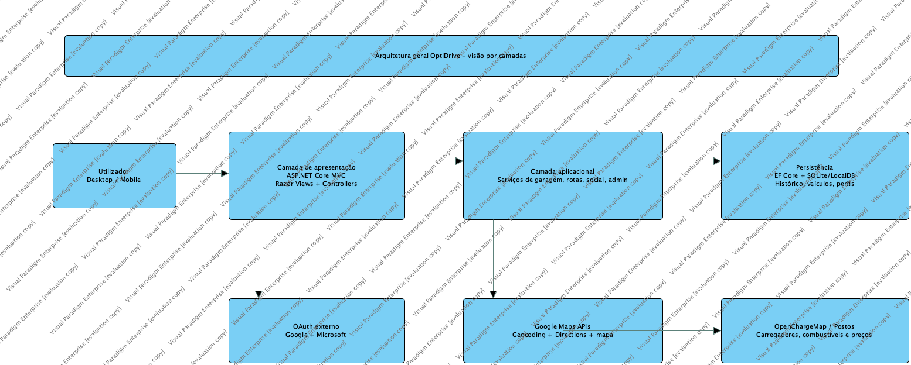
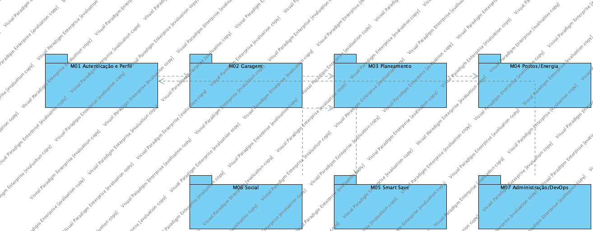
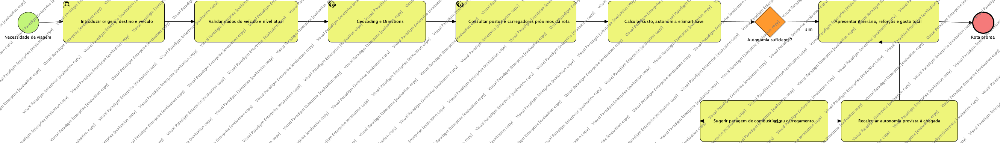
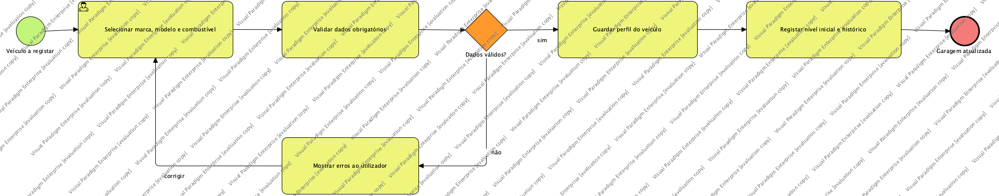
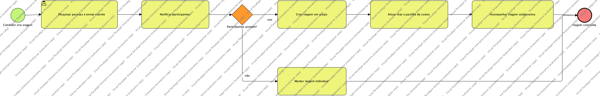

# OptiDrive - Desenho de Alto Nível

| Campo | Valor |
| --- | --- |
| Documento | Especificação do Sistema - Alto Nível |
| Template base | Template - Desenho de alto nível |
| Versão | 3.0 |
| Data | 08/07/2026 |
| Autor | Alexandre Miguel |

## 1. Sumário Executivo

Este documento descreve o desenho de alto nível do OptiDrive, traduzindo os requisitos em arquitetura, módulos, processos de negócio, interface, persistência, componentes e deployment. A solução usa ASP.NET Core MVC, EF Core, SQLite, Docker e integrações externas configuráveis.

## 2. Introdução

O desenho segue os princípios apresentados nos slides de desenho: separação de responsabilidades, arquitetura modular, representação distinta de dados, componentes, interfaces e implantação. O objetivo é fornecer uma visão técnica clara para implementação, teste e manutenção.

## 3. Desenho de Alto Nível

### 3.1 Arquitetura Geral

*Figura 1 - Arquitetura geral ASP.NET Core MVC.*

A arquitetura está organizada em apresentação MVC, serviços de domínio, acesso a dados e integrações externas. A UI Razor/JavaScript comunica com controllers; os controllers delegam regras de negócio para serviços; os serviços persistem por EF Core e comunicam com APIs externas quando configuradas.

### 3.2 Arquitetura Lógica

*Figura 2 - Diagrama de pacotes lógicos.*

### 3.3 Diagrama de Classes de Desenho

*Figura 3 - Diagrama de classes de domínio.*

### 3.4 Processos de Negócio

#### 3.4.1 Identificação dos processos

| ID | Processo | Tipo BPMN | Objetivo |
| --- | --- | --- | --- |
| P01 | Planeamento de rota e Smart Save | Processo interno com interação externa | Calcular rota, custos, autonomia e reforços |
| P02 | Gestão de garagem e histórico | Processo interno | Manter dados operacionais do veículo |
| P03 | Viagem colaborativa social | Colaboração | Permitir interação entre condutores e participantes |

#### 3.4.2 Diagramas dos processos de negócio

*Figura 4 - BPMN planeamento de rota e Smart Save.*

*Figura 5 - BPMN gestão de garagem.*

*Figura 6 - BPMN viagem colaborativa.*

### 3.5 Interface com o Utilizador

#### 3.5.1 Introdução

A interface organiza a experiência em páginas principais: Perfil, Garagem, Planeamento, Social e Administração. A navegação foi desenhada para suportar o fio condutor do produto: escolher veículo, planear viagem, validar autonomia, guardar/aplicar rota e colaborar socialmente.

#### 3.5.2 Protótipo/mock-up em alternativa

A aplicação implementada funciona como protótipo navegável. As páginas Razor representam o mock-up funcional: `Home/Login`, `Profile`, `Garage`, `Planning`, `Social` e `Admin`.

#### 3.5.3 Normas

| Elemento | Norma aplicada |
| --- | --- |
| Cores | Verde petróleo como cor principal, tons claros para cartões e estados |
| Tipografia | Fonte web legível, hierarquia clara em títulos e cartões |
| Acessibilidade | Contraste elevado, botões visíveis e feedback de validação |
| Responsividade | Layout preparado para desktop e telemóvel |
| Internacionalização | Português e Inglês em áreas principais |

#### 3.5.4 Diagrama Geral de Navegação

| Origem | Destino | Condição |
| --- | --- | --- |
| Login | Perfil | Login válido |
| Perfil | Garagem | Utilizador autenticado |
| Garagem | Planeamento | Veículo disponível |
| Planeamento | Garagem | Rota aplicada ao veículo |
| Perfil | Social | Perfil social ativo |
| Admin | Backoffice | Utilizador com role Admin |

#### 3.5.5 Matriz de acessos

| Área | Visitante | Condutor | Participante | Admin |
| --- | --- | --- | --- | --- |
| Login/Registo | Sim | Sim | Sim | Sim |
| Perfil | Não | Sim | Sim | Sim |
| Garagem | Não | Sim | Parcial | Sim |
| Planeamento | Não | Sim | Parcial | Sim |
| Social | Não | Sim | Sim | Sim |
| Administração | Não | Não | Não | Sim |

### 3.6 Persistência

#### 3.6.1 Introdução

A persistência é suportada por EF Core e SQLite. As entidades principais são UserAccount, VehicleProfile, PlannedRoute, FuelStation, VehicleActivity, SocialProfile, DirectMessage, CollaborativeTrip e ApiSyncStatus.

#### 3.6.2 Modelo Relacional

| Entidade | Chave | Relações principais |
| --- | --- | --- |
| UserAccount | Id | 1:1 SocialProfile, 1:N Vehicles, 1:N Routes |
| VehicleProfile | Id | N:1 UserAccount, 1:N VehicleActivity |
| PlannedRoute | Id | N:1 UserAccount, N:1 VehicleProfile |
| FuelStation | Id | Consultada por Planeamento/Smart Save |
| CollaborativeTrip | Id | N:1 UserAccount, opcionalmente N:1 Route/Vehicle |
| DirectMessage | Id | N:1 UserAccount, opcionalmente N:1 CollaborativeTrip |

### 3.7 Arquitetura Física

#### 3.7.1 Introdução

O sistema pode ser executado localmente, em Docker ou em Azure App Service. A configuração sensível é feita por variáveis de ambiente.

#### 3.7.2 Diagrama de Componentes

*Figura 7 - Diagrama de componentes.*

#### 3.7.3 Diagrama de Instalação

*Figura 8 - Diagrama de deployment.*

### 3.8 Normas de Codificação da Aplicação

| Norma | Aplicação |
| --- | --- |
| Separação MVC | Controllers não devem concentrar regras complexas de domínio |
| Serviços | Regras como Smart Save, TOTP e APIs externas ficam em services |
| ViewModels | Dados de ecrã separados de entidades persistidas |
| Configuração | Chaves e URLs por `.env`/environment variables |
| Segurança | Antiforgery tokens, cookies HttpOnly e MFA configurável |
