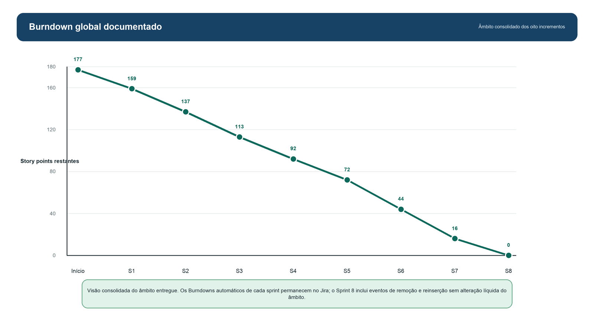
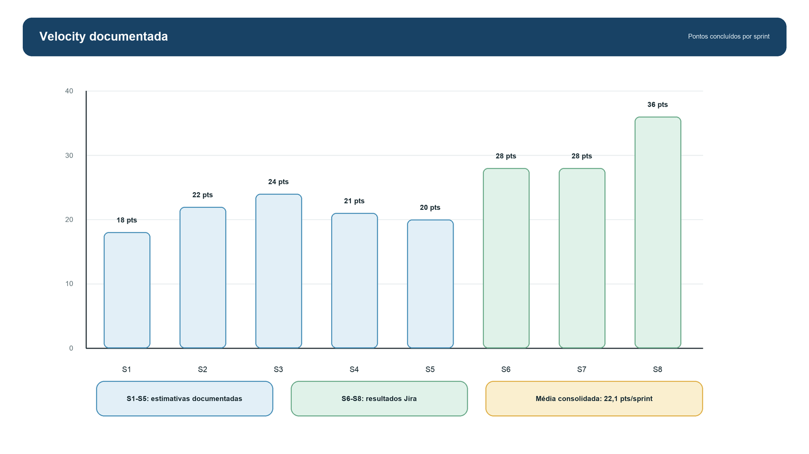

# OptiDrive - Plano de Testes e Métricas

| Campo | Valor |
| --- | --- |
| Projeto | OptiDrive |
| Documento | Plano de Testes e Métricas |
| Template base | ESA Test Case Templates |
| Versão | 3.1 |
| Data | 13/07/2026 |
| Autor | Alexandre Miguel |
| Stack de testes | xUnit, testes manuais, UAT, usabilidade, stress e validação operacional |

## 1. Objetivo

Este documento define a estratégia de testes e as métricas usadas para validar o OptiDrive. A estrutura segue os campos recomendados no template ESA Test Case Templates: identificador único, requisito rastreado, prioridade/risco, ambiente, pré-condições, passos, resultado esperado, resultado obtido e critério Pass/Fail.

## 2. Âmbito de Teste

| Área | Incluído | Fora de Âmbito / Futuro |
| --- | --- | --- |
| Autenticação | Login local, MFA TOTP, roles, OAuth configurável | Auditoria externa de segurança |
| Garagem | CRUD de veículos, níveis, abastecimento/carga, histórico | Integração OBD real |
| Planeamento | Origem/destino, rota, postos, Smart Save e autonomia | Cálculo oficial de portagens por fornecedor pago |
| Social | Perfis, contactos, mensagens e viagens colaborativas | Chat em tempo real com WebSockets |
| Admin | Utilizadores, MFA, locks, sincronizações e healthcheck | SIEM/monitorização avançada |
| DevOps | Build, testes, Docker, Azure, variaveis de ambiente | Pipeline CI/CD implementada e configuravel |

## 3. Ambiente de Teste

| Ambiente | Tecnologia | Finalidade |
| --- | --- | --- |
| Local | macOS, .NET 8, SQLite | Desenvolvimento e teste funcional |
| Testes automatizados | xUnit | Validação de serviços e regras de domínio |
| Docker | Docker Compose | Execução reproduzível e validação de configuração |
| Azure | App Service Linux | Demonstração pública/controlada |
| Browser | Safari/Chrome | Validação de UI, responsividade e OAuth |

## 4. Campos Base dos Test Cases

| Campo | Descrição |
| --- | --- |
| TC-ID | Identificador único no formato `PREFIXO-MÓDULO-NNN` |
| Nome / Título | Descrição curta e específica do comportamento testado |
| Requisito Rastreado | ID do requisito funcional, requisito de qualidade ou bug |
| Prioridade / Risco | Crítica, Alta, Média ou Baixa |
| Ambiente e Pré-condições | Estado inicial, utilizador, veículo, dados e APIs necessárias |
| Passos de Execução | Sequência reproduzível de ações |
| Resultado Esperado | Estado final ou resposta esperada |
| Resultado Obtido | Evidência observada |
| Critério Pass/Fail | Regra objetiva para aceitação |

## 5. Estratégia de Teste

| Nível | Objetivo | Responsável | Evidência |
| --- | --- | --- | --- |
| Unitário | Validar regras isoladas de domínio | QA/Dev | `OptiDrive.Web.Tests` |
| Integração | Validar controller + service + persistência/API | QA/Dev | Execução manual e logs |
| Sistema | Validar fluxos E2E | QA/Dev | Checklist funcional |
| Aceitação | Validar valor de negócio | Stakeholder/Autor | Cenários Given/When/Then |
| Regressão | Garantir que bugs corrigidos não regressam | QA/Dev | Reexecução de fluxos críticos |
| Segurança | Validar autenticação, autorização e MFA | QA/Dev | Testes manuais e unitários |
| Usabilidade | Medir perceção de utilizadores | Utilizadores avaliadores | Forms/NPS/feedback |

## 6. Testes Automatizados Existentes

| Ficheiro | Teste | Objetivo |
| --- | --- | --- |
| `SmartSaveServiceTests.cs` | `BuildRouteAsync_WithEnoughAutonomy_RecommendsStationWithoutIntermediateStops` | Validar rota quando a autonomia é suficiente |
| `SmartSaveServiceTests.cs` | `BuildRouteAsync_ForLowBatteryEv_PlansIntermediateStops` | Validar reforços/paragens em EV com bateria baixa |
| `SmartSaveServiceTests.cs` | `BuildRouteAsync_HigherSpeed_IncreasesConsumptionEstimate` | Validar aumento de consumo por velocidade |
| `AppStateServiceTests.cs` | `AddVehicle_ForNewUser_CreatesDefaultVehicleAndHistoryEntry` | Validar criação de veículo e histórico |
| `AppStateServiceTests.cs` | `ApplyRouteToVehicle_UpdatesVehicleStateAndMarksRouteAsApplied` | Validar aplicação de viagem ao veículo |
| `AppStateServiceTests.cs` | `SendDirectMessage_AddsConversationToSocialDashboard` | Validar mensagens sociais |
| `AppStateServiceTests.cs` | `CollaborativeTrip_CanBeCreatedJoinedAndStarted` | Validar viagem colaborativa |
| `AppStateServiceTests.cs` | `Register_StoresHashedPasswordAndValidatesLogin` | Validar hash e login local |
| `AppStateServiceTests.cs` | `Authenticator_CanBeEnabledAndVerifiedWithTotp` | Validar MFA TOTP |
| `AppStateServiceTests.cs` | `AdminActions_ManageUserSecurityWithoutAllowingRegularUsers` | Validar permissoes administrativas |
| `StressTests.cs` | `LocalState_With500UsersAnd500Vehicles_RemainsResponsive` | Validar carga local com 500 utilizadores e 500 veiculos |
| `ProjectEvidenceServiceTests.cs` | 3 testes de evidência administrativa | Validar fontes acionáveis, métricas e fallback de `RF-M08-04` |
| `HealthControllerTests.cs` | `Index_ReturnsHealthyStatusWithoutSecrets` | Validar Healthy e ausência de segredos |

## 7. Testes Unitários

| TC-ID | Componente e Método | Requisito / Prioridade | Pré-condições | Passos | Resultado Esperado | Estado |
| --- | --- | --- | --- | --- | --- | --- |
| UT-M05-001 | SmartSaveService > BuildRouteAsync | RF-M05-01 / Alta | Veículo com autonomia suficiente | Calcular rota com distância conhecida | Consumo e custo calculados sem reforço obrigatório | Automatizado |
| UT-M05-002 | SmartSaveService > BuildRouteAsync | RF-M05-04 / Alta | EV com bateria baixa | Calcular rota longa | Sistema sugere paragens intermédias | Automatizado |
| UT-M05-003 | SmartSaveService > BuildRouteAsync | RF-M05-02 / Alta | Duas velocidades médias | Comparar rota lenta e rápida | Velocidade maior aumenta fator de consumo | Automatizado |
| UT-M02-001 | AppStateService > AddVehicle | RF-M02-01 / Alta | Novo utilizador | Adicionar veículo válido | Veículo e histórico criados | Automatizado |
| UT-M01-001 | AppStateService/Auth | RF-M01-05 / Alta | Utilizador com segredo TOTP | Validar código Authenticator | MFA fica ativo e código válido é aceite | Automatizado |

## 8. Testes de Integração

| TC-ID | Componentes Integrados | Ponto de Integração | Setup | Passos | Resultado Esperado |
| --- | --- | --- | --- | --- | --- |
| IT-M02-001 | GarageController + AppStateService + EF Core | Persistência SQLite | Utilizador autenticado e DB disponível | Criar veículo na UI | Veículo aparece na garagem e persiste |
| IT-M03-001 | PlanningController + SmartSaveService + GoogleDirectionsService | Google Directions / fallback | API key configurada ou fallback | Calcular rota | Rota é criada ou erro controlado é apresentado |
| IT-M04-001 | ApiController + ExternalFuelStationService | Fonte de postos/preços | Serviço externo disponível ou cache | Consultar postos por combustível/marca | Lista filtrada é devolvida |
| IT-M06-001 | SocialController + AppStateService | Persistência social | Dois utilizadores seed | Enviar mensagem direta | Conversa aparece no dashboard social |
| IT-M07-001 | AdminController + AppStateService | Gestão de utilizadores | Admin autenticado | Reset MFA/bloquear utilizador | Ação só é permitida a admin |

## 9. Testes de Sistema

| TC-ID | Cenário de Negócio | Escopo | Fluxo Principal | Duração Máxima | Critério Pass/Fail |
| --- | --- | --- | --- | --- | --- |
| ST-001 | Criar conta e gerir garagem | Login + Garagem | Registar, entrar, criar veículo, atualizar nível | 5 min | Veículo visível e histórico atualizado |
| ST-002 | Planear viagem e aplicar ao veículo | Garagem + Planeamento + Smart Save | Selecionar veículo, calcular rota, guardar/aplicar | 7 min | Nível final do veículo é ajustado e rota marcada aplicada |
| ST-003 | Usar componente social | Social | Procurar pessoa, enviar pedido/mensagem, criar viagem | 7 min | Interação fica registada sem expor email desnecessário |
| ST-004 | Operação administrativa | Admin + Health | Entrar como admin, ver health, gerir MFA/locks | 5 min | Backoffice responde sem erro |
| ST-005 | Internacionalização e tema | UI transversal | Alternar PT/EN e claro/escuro | 3 min | Textos principais e tema atualizam |

## 10. Testes de Aceitação (UAT)

| TC-ID | História / Critério | Given | When | Then | Stakeholder Validador |
| --- | --- | --- | --- | --- | --- |
| AT-M02-001 | O condutor gere os seus veículos | Dado que o utilizador está autenticado | Quando cria ou edita um veículo | Então o veículo fica associado à sua conta | Utilizador final |
| AT-M03-001 | O condutor planeia uma rota específica | Dado que existe um veículo selecionado | Quando introduz origem e destino | Então o sistema mostra rota, distância e custos | Utilizador final |
| AT-M05-001 | O sistema evita chegada a 0% | Dado que a autonomia é limitada | Quando a rota é calculada | Então são sugeridos reforços e margem de chegada | Utilizador final |
| AT-M06-001 | O utilizador combina viagens em grupo | Dado que existem perfis sociais | Quando cria viagem colaborativa | Então participantes conseguem aderir/iniciar viagem | Participante social |
| AT-M07-001 | O admin controla segurança operacional | Dado que o admin está autenticado | Quando gere MFA/locks | Então utilizadores comuns não conseguem executar ações admin | Administrador |

## 11. Testes de Regressão

| TC-ID | Defeito/Regressão Coberta | Baseline | Versão Sob Teste | Passos | Resultado Esperado |
| --- | --- | --- | --- | --- | --- |
| RT-MFA-001 | Código TOTP era rejeitado por binding/formato | Versão anterior com erro de 2FA | Versão final | Ativar MFA e validar código de 6 dígitos | Código válido é aceite |
| RT-OAUTH-001 | Callback OAuth ficava em branco/erro | Versão com redirect incorreto | Versão final | Login Google/Microsoft com callback configurado | Redireciona para aplicação |
| RT-GAR-001 | Garagem dizia que faltavam campos apesar de preenchidos | Versão anterior | Versão final | Criar veículo com marca/modelo/combustível | Veículo é guardado |
| RT-PLAN-001 | Admin abria planeamento e causava NullReference | Versão anterior | Versão final | Entrar como admin e abrir planeamento | Página responde sem exceção |
| RT-MAP-001 | Postos apareciam em excesso/fora da rota | Versão anterior | Versão final | Calcular rota com postos próximos | Marcadores ficam filtrados por rota/combustível |

## 12. Testes de Desempenho e Carga

| TC-ID | Cenário e Perfil | Métricas a Recolher | Threshold | Resultado Esperado |
| --- | --- | --- | --- | --- |
| PT-001 | 20 utilizadores a consultar garagem/social | Tempo resposta, erros, CPU | P95 < 1.5s em ambiente local controlado | Sem erros criticos |
| PT-004 | 500 utilizadores e 500 veiculos em memoria/local state | Tempo de criacao e tempo de dashboards | Criacao < 10s e dashboards < 10s | Aprovado: 8,518 s e 0,327 s, respetivamente |
| PT-002 | 10 utilizadores a calcular rotas | Latência API, fallback, erros | Erro externo deve ser tratado | UI mostra feedback controlado |
| PT-003 | Refresh de postos/carregadores | Duração sync, nº itens, falhas | Sync não bloqueia UI | Estado visível no Admin |

## 13. Testes de Segurança

| TC-ID | Ameaça / Alvo | Pré-condições | Vetor | Evidência de Pass | Severidade |
| --- | --- | --- | --- | --- | --- |
| SEC-AUTH-001 | Palavra-passe em texto claro | Conta local criada | Consultar estado/dados | Password fica hashed, não em texto claro | Alta |
| SEC-MFA-001 | Bypass de MFA | Utilizador com MFA ativo | Login sem código válido | Acesso bloqueado até TOTP válido | Alta |
| SEC-AUTHZ-001 | Acesso admin por user normal | Utilizador sem role Admin | Abrir `/Admin` ou ação admin | Acesso negado/ação falha | Alta |
| SEC-CSRF-001 | Submissão POST indevida | Sessão válida | POST sem antiforgery onde aplicável | Pedido rejeitado ou controlado | Média |
| SEC-CONF-001 | Exposição de chaves no repositório | Código fonte | Pesquisa por secrets | Chaves devem vir de variáveis de ambiente | Alta |

## 14. Testes de Usabilidade

| TC-ID | Perfil / Cenário | Métricas Quantitativas | Métricas Qualitativas | Critério Pass/Fail |
| --- | --- | --- | --- | --- |
| UX-001 | Condutor cria veículo e consulta ficha | <= 2 min, <= 6 cliques críticos | Clareza da garagem >= 4/5 | Passa se conclui sem ajuda |
| UX-002 | Condutor calcula rota e interpreta custos/autonomia | <= 3 min | Clareza do Smart Save >= 4/5 | Passa se entende reforços e custo total |
| UX-003 | Utilizador encontra a área social | <= 90s | Perceção de utilidade social >= 4/5 | Passa se consegue enviar interação |
| UX-004 | Utilizador alterna modo claro/escuro | <= 30s | Conforto visual >= 4/5 | Passa se identifica e usa a opção |

## 15. Métricas de Gestão

| Métrica | Valor |
| --- | --- |
| Sprints planeadas | 8 |
| Sprints documentadas | 8 (auditoria técnica da Sprint 8 concluída em 07/09) |
| Atas documentadas | 8 |
| Módulos documentados | 7 |
| Requisitos funcionais | 35 |
| Use cases | 15 |
| Testes automatizados | 16 |
| Tipos de teste cobertos | 8 |
| Itens de roadmap futuro | 8 |

*Figura 1 - Burndown geral.*

*Figura 2 - Velocity geral.*

## 16. Métricas de Produto e Usabilidade

| Métrica | Resultado | Interpretação |
| --- | --- | --- |
| Respostas analisadas | 31 | Amostra académica suficiente para feedback inicial |
| NPS | +71 | Forte probabilidade de recomendação |
| Média global | 4.44/5 | Boa aceitação visual/funcional |
| Respostas favoráveis | 91.1% | Validação positiva da experiência |
| Principais melhorias | Performance, dados externos, mobile polish | Roadmap futuro |

## 17. Critérios de Entrada e Saída

| Fase | Critério de Entrada | Critério de Saída |
| --- | --- | --- |
| Teste unitário | Código compilável e serviço isolável | Testes xUnit passam |
| Teste integração | Dados seed e configuração mínima | Fluxo persiste/consulta corretamente |
| Teste sistema | Ambiente local/Docker funcional | Fluxo E2E sem erro bloqueante |
| Teste aceitação | Cenário de negócio definido | Stakeholder/utilizador confirma valor |
| Regressão | Bug corrigido identificado | Bug não reaparece na versão final |

## 18. Rastreabilidade Teste-Requisito

| Requisito | Testes Associados |
| --- | --- |
| RF-M01-01, RF-M01-02 | UT-M01-001, SEC-AUTH-001, ST-001 |
| RF-M01-05, RF-M01-06 | UT-M01-001, SEC-MFA-001, RT-MFA-001 |
| RF-M02-01 a RF-M02-05 | UT-M02-001, IT-M02-001, ST-001, ST-002 |
| RF-M03-01 a RF-M03-05 | IT-M03-001, ST-002, RT-MAP-001 |
| RF-M04-01 a RF-M04-05 | IT-M04-001, PT-003, RT-MAP-001 |
| RF-M05-01 a RF-M05-05 | UT-M05-001, UT-M05-002, UT-M05-003, AT-M05-001 |
| RF-M06-01 a RF-M06-05 | IT-M06-001, ST-003, AT-M06-001 |
| RF-M07-01 a RF-M07-04 | IT-M07-001, SEC-AUTHZ-001, ST-004 |
| RF-M08-01, RF-M08-04 | `HealthControllerTests`, `ProjectEvidenceServiceTests`, UAT-013, UAT-014 |
| RF-M10-01 a RF-M10-05 | UAT-017, UAT-018, UAT-020 e checklist de encerramento da Sprint 8 |

### 18.1 Evidências de execução da Sprint 8

- `evidencias/sprint-8/build-release-2026-09-02.txt`
- `evidencias/sprint-8/testes-release-2026-09-02.txt`
- `evidencias/sprint-8/docker-compose-config-2026-09-02.txt`
- `21-tabela-testes-aceitacao.md`
- `evidencias/sprint-8/final-2026-09-07/auditoria-final.md`
- `evidencias/sprint-8/final-2026-09-07/stress-optimized-validation.txt`
- `evidencias/sprint-8/final-2026-09-07/ci-readiness-final.txt`

## 19. Conclusão

O plano de testes cobre os níveis principais exigidos para uma aplicação académica com ambição de produto real: unitário, integração, sistema, aceitação, regressão, desempenho, segurança e usabilidade. Os 16 testes automatizados validados em Release cobrem Smart Save, autonomia, garagem, social, MFA, administração, healthcheck, `RF-M08-04` e stress com 500 utilizadores/veículos. A execução final aprovou a criação 500+500 em 8,518 s e a construção de 500 dashboards em 0,327 s. A matriz UAT está em `21-tabela-testes-aceitacao.md`.
