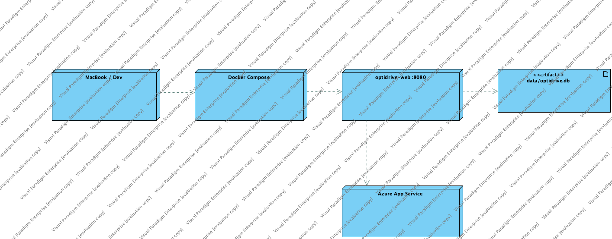

# OptiDrive - DevOps e Gestão de Erros

| Campo | Valor |
| --- | --- |
| Projeto | OptiDrive |
| Documento | DevOps e Gestão de Erros |
| Versão | 3.4 |
| Data | 08/09/2026 |
| Autor | Alexandre Miguel |
| Stack | ASP.NET Core MVC, .NET 8, EF Core, SQLite, Docker, Azure App Service |

## 1. Objetivo

Este documento descreve a abordagem DevOps e o processo de gestão de erros do OptiDrive: ambientes, configuração, build, testes, deploy, observabilidade, classificação de incidentes, ciclo de correção e plano de melhoria operacional.

## 2. Arquitetura Operacional

| Camada | Tecnologia | Responsabilidade |
| --- | --- | --- |
| Interface | Razor Views, CSS, JavaScript | Experiência web, mapas, social e formulários |
| Aplicação | ASP.NET Core MVC / .NET 8 | Controllers, serviços de domínio e validações |
| Domínio | AppStateService, SmartSaveService, AuthenticatorService | Regras de negócio, rotas, garagem, social e MFA |
| Dados | EF Core + SQLite | Persistência local/ambiente Docker |
| Integrações | Google Maps, OpenChargeMap, OAuth | Mapas, geocoding, carregadores e login externo |
| Operação | Docker, Azure App Service, Healthcheck | Execução reproduzível e monitorização básica |

*Figura 1 - Diagrama de instalação.*

## 3. Ambientes

| Ambiente | Tecnologia | Finalidade | Estado |
| --- | --- | --- | --- |
| Desenvolvimento local | .NET 8 + SQLite | Implementação e testes rápidos | Ativo |
| Testes locais | xUnit | Validação automatizada | Ativo |
| Docker | Docker Compose | Execução reproduzível, persistência e healthcheck automático | Ativo e revalidado em 08/09 |
| Azure | App Service Linux | Demonstração online | Workflow preparado; ambiente público não ativo sem credenciais |
| Confluence/Jira | Atlassian | Documentação e gestão do projeto | Ativo |

## 4. Configuração por Ambiente

| Configuração | Local | Docker | Azure |
| --- | --- | --- | --- |
| Base de dados | SQLite em `App_Data` | Volume/container | Connection string por App Settings |
| Chaves Google Maps | `.env`/user-secrets | `.env` | Environment variables |
| OpenChargeMap | `.env`/user-secrets | `.env` | Environment variables |
| OAuth Google/Microsoft | `.env`/user-secrets | `.env` | App Settings + callback público |
| Logging | Console/dev logs | Container logs | Log stream/App Service logs |
| Healthcheck | `/health` | Automático no Compose + `/health` | `/health` público/controlado |

## 5. Variáveis de Ambiente

| Variável | Finalidade | Obrigatória para produção? | Observação |
| --- | --- | --- | --- |
| `ConnectionStrings__OptiDrive` | Ligação à base de dados | Sim | SQLite local ou DB gerida futura |
| `GOOGLE_MAPS_API_KEY` | Mapas, geocoding e directions | Sim para mapas completos | Deve ter restrições por domínio/API |
| `OPEN_CHARGE_MAP_API_KEY` | Carregadores elétricos | Recomendado | Melhora cobertura EV |
| `Authentication__Google__ClientId` | OAuth Google | Opcional | Necessita callback correto |
| `Authentication__Google__ClientSecret` | OAuth Google | Opcional | Nunca guardar no Git |
| `Authentication__Microsoft__ClientId` | OAuth Microsoft | Opcional | Necessita app registration |
| `Authentication__Microsoft__ClientSecret` | OAuth Microsoft | Opcional | Nunca guardar no Git |
| `ASPNETCORE_ENVIRONMENT` | Ambiente runtime | Sim | Development/Staging/Production |

## 6. Pipeline CI/CD Implementada

| Etapa | Ficheiro / Ferramenta | Regra de Qualidade |
| --- | --- | --- |
| Restore | `.github/workflows/ci.yml` | Dependencias restauradas antes de build |
| Build | `.github/workflows/ci.yml` + `dotnet build` | Falha se a solucao nao compilar |
| Testes | `.github/workflows/ci.yml` + xUnit | Falha se algum teste automatizado falhar |
| Publicacao | `.github/workflows/ci.yml` + `dotnet publish` | Artefacto web gerado para release |
| Docker build | `.github/workflows/ci.yml` + Docker | Imagem validada por commit |
| Deploy Azure | `.github/workflows/azure-deploy.yml` | Deploy manual ou apos CI com sucesso |
| Formatação | `.github/workflows/ci.yml` + `dotnet format` | Falha se existirem diferenças de formatação |
| Dependências | `.github/workflows/ci.yml` + auditoria NuGet | Falha se forem reportadas vulnerabilidades conhecidas |
| Evidência de testes | Artefacto TRX | Resultado preservado em cada execução da CI |

Em 08/09/2026, as duas definições foram revalidadas. A execução remota `34206950037` aprovou restore, build, formatação, auditoria de dependências, `16/16` testes, artefacto TRX, publicação e Docker. O workflow Azure `34207149170` concluiu restore/publicação e omitiu corretamente o deploy, porque as credenciais Azure não estão configuradas no repositório.

## 7. Pipeline Manual de Recuperacao e Validacao

| Passo | Comando / Acao | Resultado Esperado |
| --- | --- | --- |
| 1 | `dotnet restore` | Dependencias restauradas |
| 2 | `dotnet build OptiDrive.sln` | Build sem erros |
| 3 | `dotnet test OptiDrive.sln --configuration Release` | 16 testes a passar |
| 4 | `docker compose up --build` | Aplicacao disponivel em container |
| 5 | Abrir `/health` | JSON/estado saudavel |
| 6 | Validar login local e MFA | Sessao segura e MFA funcional |
| 7 | Validar garagem e planeamento | Veiculo, rota e Smart Save funcionais |
| 8 | Validar social/admin | Perfis, mensagens e backoffice funcionais |
| 9 | Executar workflow Azure | Artefacto preparado; deploy apenas quando existirem credenciais válidas |

## 8. Observabilidade

| Mecanismo | O que mede | Como usar |
| --- | --- | --- |
| `/health` | Estado básico da app, ambiente e dependências | Verificação manual e healthcheck automático do Docker Compose |
| Admin Dashboard | Utilizadores, MFA, locks, sincronizações | Operação e suporte |
| ApiSyncStatus | Última sincronização de APIs externas | Diagnóstico de dados externos |
| Logs ASP.NET | Exceções e warnings | Debug local/Azure Log Stream |
| Testes xUnit | Regressões funcionais | Pré-entrega e pipeline CI implementada |

## 9. Gestão de Erros - Classificação

| Severidade | Critério | Exemplos | SLA Académico |
| --- | --- | --- | --- |
| Crítica | Impede login, arranque ou fluxo principal | App não abre, login falha, rota gera exceção | Corrigir antes da entrega |
| Alta | Afeta garagem, planeamento, social ou admin sem workaround aceitável | Veículo não guarda, Smart Save incorreto | Corrigir na sprint/patch atual |
| Média | Afeta experiência mas existe workaround | Texto parcial PT/EN, layout inconsistente | Corrigir quando estabilizar críticos |
| Baixa | Polimento visual ou melhoria futura | Microcopy, animação, refinamento UI | Roadmap |

## 10. Ciclo de Vida de Defeitos

| Estado | Descrição | Critério de Entrada | Critério de Saída |
| --- | --- | --- | --- |
| Novo | Defeito identificado | Report, screenshot ou reprodução | Triagem concluída |
| Triado | Severidade e módulo atribuídos | Defeito compreendido | Priorizado para correção |
| Em correção | Alteração em curso | Responsável definido | Pull/commit pronto |
| Em teste | Correção aplicada | Build executável | Teste/regressão passa |
| Fechado | Defeito validado | Evidência de teste | Sem regressão conhecida |
| Diferido | Não bloqueante e fora do escopo atual | Impacto aceitável | Roadmap/documentação |

## 11. Registo de Erros Relevantes e Mitigação

| ID | Erro/Risco | Severidade | Causa | Mitigação / Estado |
| --- | --- | --- | --- | --- |
| BUG-001 | OAuth com `redirect_uri_mismatch` | Alta | Callback diferente entre app e provider | Documentar callbacks e usar App Settings corretos |
| BUG-002 | MFA pedia código novamente | Alta | Binding/formato de input e validação TOTP | Teste unitário e validação manual do fluxo |
| BUG-003 | Garagem dizia que faltavam campos | Alta | Validação/model binding incompleto | Ajustar viewmodel e mensagens |
| BUG-004 | Admin abria planeamento com NullReference | Crítica | Admin sem veículo/rota selecionável | Guard clauses e fallback de utilizador/veículo |
| BUG-005 | Postos em excesso no mapa | Média | Marcadores não filtrados por rota/combustível | Filtrar por proximidade, combustível e marca |
| BUG-006 | Autonomia final a 0% | Alta | Margem mínima não considerada | Reserva mínima de chegada e reforços |
| BUG-007 | Inglês parcial | Média | Strings ainda hardcoded | Centralizar traduções e rever views |

## 12. Fluxo de Reporte de Erros

1. Registar o erro no Jira com módulo, severidade e passos de reprodução.
2. Associar screenshot/log quando existir.
3. Confirmar se afeta requisito Must/Should/Could.
4. Corrigir em branch/commit controlado.
5. Executar `dotnet build` e `dotnet test`.
6. Validar manualmente o fluxo afetado.
7. Atualizar estado no Jira e, se relevante, a documentação.

## 13. Matriz Erro-Requisito

| Erro | Requisito Relacionado | Teste de Regressão |
| --- | --- | --- |
| BUG-001 | RF-M01-04 | RT-OAUTH-001 |
| BUG-002 | RF-M01-05, RF-M01-06 | RT-MFA-001 |
| BUG-003 | RF-M02-01, RF-M02-02 | RT-GAR-001 |
| BUG-004 | RF-M07-01, RF-M03-01 | RT-PLAN-001 |
| BUG-005 | RF-M04-01, RF-M04-04 | RT-MAP-001 |
| BUG-006 | RF-M05-03, RF-M05-04, RF-M05-05 | UT-M05-002 |
| BUG-007 | RQ-01 | UX-004 |

## 14. Estratégia de Backup e Recuperação

| Ativo | Estratégia Atual | Estratégia Recomendada para Produção |
| --- | --- | --- |
| Código | Git/GitHub | Branch protection e tags de release |
| SQLite local | Ficheiro/volume | Backups automáticos e migração para DB gerida |
| Configuração | `.env.example` + App Settings | Key Vault e rotação de secrets |
| Documentação | Confluence | Export periódico PDF/Word |
| Dados externos | Cache/fallback local | Jobs programados e alertas de falha |

## 15. Segurança Operacional

| Área | Medida Atual | Reforço Futuro |
| --- | --- | --- |
| Passwords | Hash seguro no serviço de autenticação | Política de complexidade/lockout avançada |
| MFA | TOTP Authenticator | Recovery flow auditado e alertas |
| Cookies | Sessão ASP.NET Core | Secure cookies em produção HTTPS |
| Roles | Admin vs utilizador normal | Políticas granulares por ação |
| Secrets | Variáveis de ambiente | Azure Key Vault |
| Logs | Console/App Service | Centralização e alertas |

## 16. Readiness Checklist

| Critério | Estado | Observação |
| --- | --- | --- |
| Build sem erros | Pronto | Validável por `dotnet build` |
| Testes automatizados | Pronto | 16 testes xUnit, incluindo healthcheck, RF-M08-04 e stress com 500 utilizadores e 500 veículos |
| Docker Compose | Pronto | Build, arranque, persistência e estado `healthy` revalidados em 08/09/2026 |
| Azure App Service | Condicionado | Workflow preparado; requer nome da aplicação e publish profile válidos |
| Healthcheck | Pronto | `/health` HTTP 200; 8 utilizadores, 8 veículos e 2 rotas mantidos após reinício |
| OAuth | Configurável | Depende de callbacks por domínio |
| Documentação | Pronto | Confluence e docs locais |
| Backups/monitorização avançada | Parcial | Roadmap produção |

## 17. Evidências de Validação Final

| Verificação | Resultado | Evidência |
| --- | --- | --- |
| Build Release | Aprovado: 0 erros e 0 avisos | `evidencias/sprint-8/build-release-2026-09-07.txt` |
| Testes automatizados | Aprovado: 16/16 | `evidencias/sprint-8/testes-release-2026-09-07.txt` |
| Configuração Compose | Aprovada | `evidencias/sprint-8/docker-compose-config-2026-09-07.yml` |
| Build e arranque Docker | Aprovado | Contentor `optidrive-web` em estado `healthy` |
| Endpoint operacional | Aprovado: HTTP 200 | `evidencias/sprint-8/healthcheck-2026-09-07.json` |
| Persistência após reinício | Aprovada | `evidencias/sprint-8/docker-persistence-health-2026-09-07.txt` |
| Interface móvel PT/EN | Aprovada em 390×844 | `evidencias/sprint-8/mobile-light-pt-2026-09-07.png` e `mobile-dark-en-2026-09-07.png` |
| Dependências NuGet | Sem vulnerabilidades conhecidas nas fontes consultadas | `evidencias/sprint-8/package-vulnerability-scan-2026-09-07.txt` |
| Execução GitHub Actions | Aprovada | Execução `34206950037` |
| Deploy Azure | Condicionado | Execução `34207149170`: validação concluída e deploy omitido por ausência de credenciais Azure |

### Revalidação de 08/09/2026

| Verificação | Resultado | Evidência |
| --- | --- | --- |
| Formatação | Aprovada, sem alterações | `evidencias/final-2026-09-08/01-format-verification.txt` |
| Build Release | Aprovado: 0 erros e 0 avisos | `evidencias/final-2026-09-08/02-release-build.txt` |
| Testes automatizados | Aprovado: 16/16 | `evidencias/final-2026-09-08/03-automated-tests.txt` |
| Stress 500+500 | Aprovado: 7,998 s + 0,405 s | `evidencias/final-2026-09-08/04-stress-500x500.txt` |
| Dependências NuGet | Sem vulnerabilidades conhecidas | `evidencias/final-2026-09-08/05-nuget-vulnerabilities.txt` |
| Docker e healthcheck | Aprovados; contentor `healthy` | `evidencias/final-2026-09-08/06-docker-compose-build-start.txt` e `07-docker-health-smoke.txt` |
| Persistência | 8 utilizadores, 8 veículos e 2 rotas preservados | `evidencias/final-2026-09-08/10-persistence-comparison.txt` |
| Usabilidade visual | Visitante, condutor e admin; PT/EN; claro/escuro; desktop/mobile | `evidencias/final-2026-09-08/20-validacao-usabilidade-visual.md` |
| Execução CI | Aprovada | GitHub Actions `34206950037` |
| Workflow Azure | Aprovado com deploy omitido por configuração | GitHub Actions `34207149170` |

A checklist técnica integral encontra-se em `evidencias/sprint-8/final-2026-09-07/auditoria-final.md`; a reprodução local está em `evidencias/sprint-8/final-2026-09-07/ci-readiness-final.txt` e a execução remota em `evidencias/sprint-8/final-2026-09-07/github-actions-validation.md`.

## 18. Plano de Melhoria DevOps

| Prioridade | Melhoria | Benefício |
| --- | --- | --- |
| Alta | Manter pipeline CI com build+test+publish | Evita regressoes antes da entrega |
| Alta | Migrar secrets para Key Vault | Reduz risco de exposição |
| Alta | Ativar Application Insights | Diagnóstico real em Azure |
| Média | Criar staging slot | Deploy sem downtime |
| Média | Adicionar testes Playwright/E2E | Cobertura de UI e fluxos reais |
| Média | Alertas para falhas de APIs externas | Operação proativa |
| Baixa | Versionamento semântico de releases | Melhor histórico de entregas |

## 19. Conclusão

A abordagem DevOps do OptiDrive é adequada para entrega académica e demonstração: build/test local, Docker, Azure configurável, healthcheck, administração e gestão documentada de erros. Para operacao comercial, a evolucao natural passa por base de dados gerida, Key Vault, monitorizacao estruturada, alertas e testes E2E automatizados.
