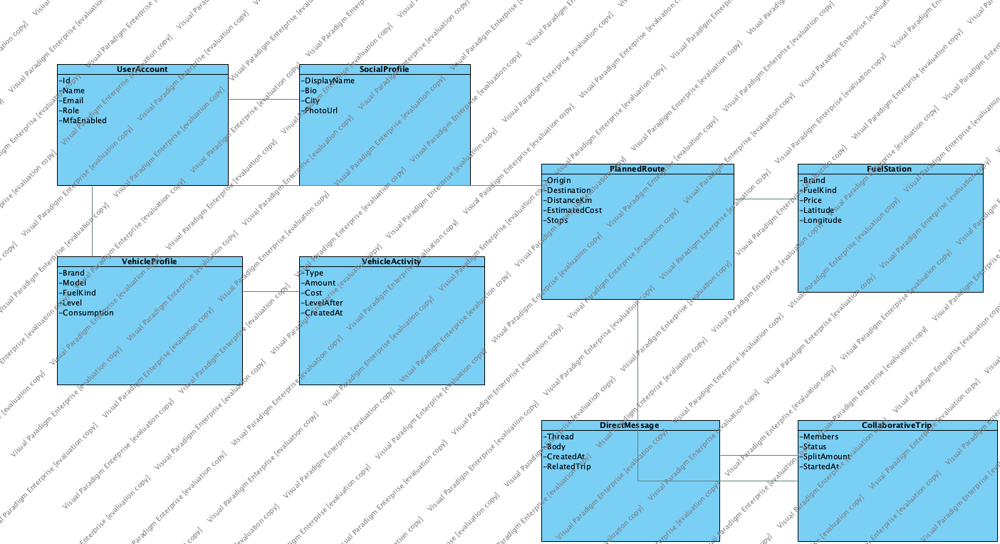
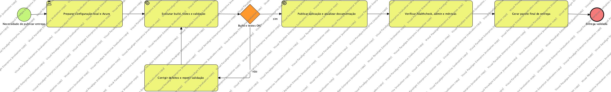
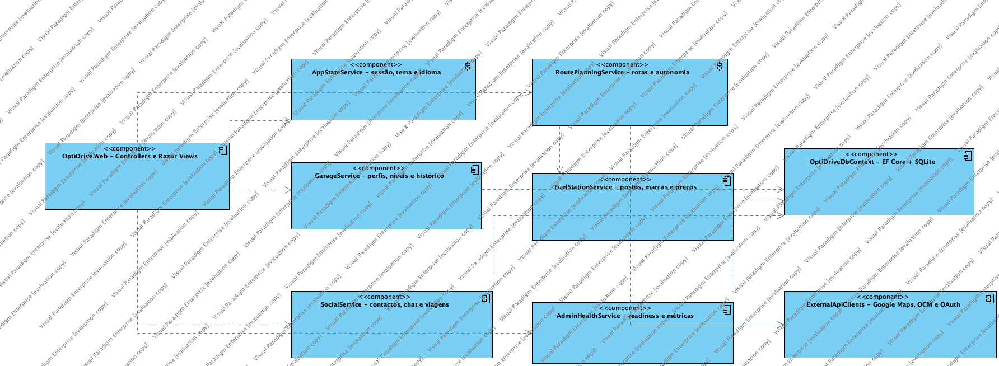

# OptiDrive - Desenho Detalhado Sprint 6

| Campo | Valor |
| --- | --- |
| Documento | Desenho detalhado - Sprint 6 - Melhorias de Código, UI e Produto |
| Template base | Template - Desenho detalhado |
| Sprint Jira | S6 - Melhorias de Codigo e UI (`269`) |
| Epic Jira | `OP-79` - Sprint 6 - Melhorias de Código, UI e Produto |
| Período configurado | 29/08/2026 a 06/09/2026 |
| Estado | Encerrada após cumprimento dos critérios de aceitação |
| Módulo | M08 - Hardening, Experiência e Readiness |
| Versão | 1.0 |
| Autor | Alexandre Miguel |

## Versões do Trabalho

| Versão | Data | Autor | Descrição |
| --- | --- | --- | --- |
| 1.0 | 31/08/2026 | Alexandre Miguel | Documento final da Sprint 6, alinhado com o incremento implementado, os testes executados e os registos Jira. |

## Índice

1. SUMÁRIO EXECUTIVO
2. INTRODUÇÃO
3. DESENHO DETALHADO
4. TESTES
5. MANUAL DE UTILIZAÇÃO
6. MANUAL TÉCNICO

## 1. SUMÁRIO EXECUTIVO

A Sprint 6 consolidou o OptiDrive como produto demonstrável e operacional. O incremento incidiu no endpoint de saúde, separação entre os perfis de condutor e administrador, apresentação visual da landing page, visibilidade do processo DevOps no backoffice e validação do pacote de publicação.

No Jira, a sprint reúne as tarefas `OP-80` a `OP-84`, totalizando 28 story points concluídos. O resultado técnico foi validado por build em Release sem erros, 16 testes automatizados aprovados após revalidação de RF-M08-04, teste de carga com 500 utilizadores e 500 veículos, construção integral da imagem Docker e resposta `Healthy` do contentor.

## 2. INTRODUÇÃO

Este documento descreve como foram implementadas e verificadas as melhorias da Sprint 6. A análise de requisitos determina o comportamento esperado; o desenho detalhado apresenta a organização técnica, os componentes envolvidos, os fluxos, a interface e as evidências de teste do incremento.

O trabalho não introduziu um novo domínio funcional isolado. Tratou-se de um incremento transversal de hardening, experiência do utilizador e readiness de entrega, aplicado à arquitetura ASP.NET Core MVC / .NET 8 já existente.

## 3. DESENHO DETALHADO

### 3.1 Introdução

O incremento foi desenvolvido no projeto `OptiDrive.Web`, mantendo a separação entre controllers MVC, serviços de domínio, views Razor, JavaScript progressivo e persistência EF Core/SQLite. As alterações preservaram os contratos funcionais dos módulos anteriores e reforçaram validação, acessibilidade, autorização por papel, observabilidade e execução em contentor.

### 3.2 Módulo/Sprint

| Módulo | Objetivo técnico | Itens Jira |
| --- | --- | --- |
| M08 - Hardening, Experiência e Readiness | Melhorar robustez, apresentação, autorização, observabilidade e preparação de release. | `OP-80`, `OP-81`, `OP-82`, `OP-83`, `OP-84` |

#### 3.2.1 Requisitos funcionais implementados

| ID | Módulo | Prioridade MoSCoW | Estado | Requisito implementado | Rastreabilidade Jira |
| --- | --- | --- | --- | --- | --- |
| RF-M08-01 | M08 | Must | Implementado | O sistema deverá expor `/health` com estado da aplicação, contagens e disponibilidade das integrações, sem revelar segredos. | `OP-80` |
| RF-M08-02 | M08 | Must | Implementado | O administrador deverá entrar no backoffice e não deverá aceder a fluxos exclusivos de condutor. | `OP-81` |
| RF-M08-03 | M08 | Should | Implementado | A landing page deverá comunicar os fluxos de garagem, planeamento e colaboração de forma clara e responsiva. | `OP-82` |
| RF-M08-04 | M08 | Must | Revalidado em 08/09/2026 | O backoffice deverá apresentar evidências acionáveis de pipeline, testes, stress, healthcheck, Jira e Confluence. | `OP-83` |
| RF-M08-05 | M08 | Must | Implementado | A solução deverá compilar, testar, publicar e construir em Docker de forma reproduzível. | `OP-84` |

Todos os requisitos previstos para a Sprint 6 foram implementados. O login Apple mantém-se configurável, mas sem credenciais de produção, e CarPlay/Android Auto permanecem classificados como `Won't Have` no âmbito académico atual.

#### 3.2.2 Diagrama de Classes de desenho detalhado do módulo

*Figura 1 - O incremento reutiliza as entidades de identidade, veículo, rota, viagem social e atividade, acrescentando validações e apresentação operacional nos controllers e serviços existentes.*

| Componente | Responsabilidade na Sprint 6 |
| --- | --- |
| `HealthController` | Produzir o estado operacional e contagens sem expor configuração sensível. |
| `AdminController` | Consolidar o backoffice, estado das integrações e operações administrativas. |
| `DashboardController` | Encaminhar o administrador para o backoffice e o condutor para o perfil. |
| `AppStateService` | Aplicar autorização, gestão de conta, garagem e dados de demonstração. |
| Views Razor e `site.css` | Melhorar hierarquia, responsividade, feedback e acessibilidade. |
| GitHub Actions / Docker | Validar build, testes, publicação e contentorização. |

#### 3.2.3 Diagramas de Processos de negócio referentes ao módulo

*Figura 2 - Processo desde a alteração no código até à validação, construção do artefacto, healthcheck e decisão de release.*

Milestones adotados no processo:

1. Código e interface revistos.
2. Build e testes automatizados executados.
3. Imagem Docker construída.
4. Aplicação iniciada e `/health` validado.
5. Evidências registadas no Jira e documentação sincronizada no Confluence.

#### 3.2.4 Diagramas de Estados referentes ao módulo

| Entidade/Processo | Estado inicial | Transições válidas | Estado terminal |
| --- | --- | --- | --- |
| Release | Em preparação | Build validado → Testes aprovados → Contentor construído → Healthcheck aprovado | Pronta para publicação |
| Aplicação | A iniciar | Inicialização → Carregamento da base → Verificação de integrações | Healthy ou Degraded |
| Utilizador | Não autenticado | Login → Validação de credenciais → MFA quando ativo → Resolução do papel | Condutor autenticado ou Administrador autenticado |
| Tarefa Jira | To Do | In Progress → validação técnica → comentário de evidência | Done |

#### 3.2.5 Interface com o utilizador referente ao módulo

| Página | Alteração/validação da Sprint 6 | Resultado esperado |
| --- | --- | --- |
| Landing page | Hierarquia, proposta de valor, chamadas à ação e adaptação mobile. | Produto compreensível antes do login. |
| Perfil | Estado da conta, papel, MFA e acessos rápidos. | Informação clara e ações sensíveis protegidas por confirmação. |
| Backoffice | Estado operacional, integrações, pipeline, testes e ações administrativas. | Administrador supervisiona sem entrar em fluxos de condutor. |
| Garagem | Feedback de operações e ficha do veículo. | Estado e histórico mantêm o utilizador no contexto certo. |
| Planeamento | Validações de origem/destino, mapa com fallback e Smart Save. | Erros controlados e rota apresentada sem bloquear a interface. |

Navegação por papel:

| Papel | Entrada após autenticação | Áreas apresentadas | Proteções |
| --- | --- | --- | --- |
| Condutor | Perfil | Perfil, Garagem, Planeamento e Social | Acesso ao backoffice é recusado. |
| Administrador | Backoffice | Administração e supervisão operacional | Garagem e Planeamento redirecionam para o backoffice com mensagem controlada. |

## 4. TESTES

Esta secção segue a estrutura do template: para cada teste são documentados o caso, os procedimentos e os resultados. As evidências correspondem ao código e ao ambiente verificados em 31/08/2026.

### 4.1 Testes Unitários

#### 4.1.1 Especificação dos Casos de testes: regras de domínio e segurança

| Campo | Valor |
| --- | --- |
| Nome Caso de teste | Regressão automatizada dos serviços principais |
| Código | UT-S6-001 |
| Finalidade | Validar Smart Save, garagem, autenticação, MFA, administração e carga do estado local. |
| Entradas | Veículos ICE/EV, rotas, contas, códigos TOTP, ações administrativas e dataset de stress. |
| Resultados esperados | Cálculos e transições de estado corretos, autorização aplicada e ausência de exceções. |
| Dependências | xUnit, `SmartSaveService`, `AppStateService` e dados controlados. |

#### 4.1.2 Especificação dos Procedimentos: regras de domínio e segurança

| Campo | Valor |
| --- | --- |
| Nome Caso de teste | Regressão automatizada dos serviços principais |
| Código | UT-S6-001 |
| Preparação | Restaurar dependências e compilar a solução. |
| Inicialização | Executar `dotnet test` em Debug e Release. |
| Recursos específicos | .NET 8 SDK, xUnit e projeto `OptiDrive.Web.Tests`. |

#### 4.1.3 Resultados: regras de domínio e segurança

| Campo | Valor |
| --- | --- |
| Nome Caso de teste | Regressão automatizada dos serviços principais |
| Código | UT-S6-001 |
| Responsável | Alexandre Miguel |
| Período de teste | 31/08/2026 |
| Resultados obtidos | 16 testes aprovados, 0 falhados e 0 ignorados em Release em 02/09/2026. |
| Observações | Inclui Smart Save, autenticação, MFA, administração, garagem, social e stress local. |

### 4.2 Testes de Automação

#### 4.2.1 Especificação dos Casos de testes: smoke test do fluxo principal

| Campo | Valor |
| --- | --- |
| Nome Caso de teste | Smoke test de navegação, perfis e feedback visual |
| Código | AUTO-S6-001 |
| Finalidade | Verificar as páginas críticas e a separação entre condutor e administrador. |
| Entradas | Sessões de condutor e administrador, páginas Perfil, Garagem, Planeamento e Admin. |
| Resultados esperados | Navegação coerente, sem `NullReferenceException`, e mensagens controladas. |
| Dependências | Aplicação local, navegador moderno e dados de demonstração. |

#### 4.2.2 Especificação dos Procedimentos: smoke test do fluxo principal

| Campo | Valor |
| --- | --- |
| Nome Caso de teste | Smoke test de navegação, perfis e feedback visual |
| Código | AUTO-S6-001 |
| Preparação | Iniciar a aplicação e confirmar a base de dados. |
| Inicialização | Autenticar cada papel, abrir as páginas críticas, submeter validações não destrutivas e observar os redirecionamentos. |
| Recursos específicos | Aplicação local, navegador e dados seed. |

#### 4.2.3 Resultados: smoke test do fluxo principal

| Campo | Valor |
| --- | --- |
| Nome Caso de teste | Smoke test de navegação, perfis e feedback visual |
| Código | AUTO-S6-001 |
| Responsável | Alexandre Miguel |
| Período de teste | 29/08/2026 a 31/08/2026 |
| Resultados obtidos | Fluxos principais e redirecionamentos por papel verificados; validação de rota inválida não criou registos. |
| Observações | A automatização de interface com Selenium/Katalon não foi adicionada; o núcleo repetível permanece coberto por xUnit e CI. |

### 4.3 Testes de Integração

Estratégia adotada: integração incremental, da camada de domínio para persistência, controllers, UI e integrações externas. Esta estratégia reduz o risco de uma integração `big bang` no final.

#### 4.3.1 Especificação dos Casos de testes: aplicação, persistência e healthcheck

| Campo | Valor |
| --- | --- |
| Nome Caso de teste | Integração do estado operacional |
| Código | IT-S6-001 |
| Finalidade | Validar a comunicação entre endpoint, estado da aplicação, SQLite e configuração das integrações. |
| Entradas | Pedido `GET /health` no ambiente local e no contentor. |
| Resultados esperados | HTTP 200, estado `Healthy`, ambiente, contagens e flags de integrações. |
| Dependências | ASP.NET Core, EF Core, SQLite e Docker. |

#### 4.3.2 Especificação dos Procedimentos: aplicação, persistência e healthcheck

| Campo | Valor |
| --- | --- |
| Nome Caso de teste | Integração do estado operacional |
| Código | IT-S6-001 |
| Preparação | Compilar a aplicação e construir a imagem Docker. |
| Inicialização | Iniciar cada ambiente e consultar `/health`. |
| Recursos específicos | `curl`, Kestrel, Docker Compose e base SQLite. |

#### 4.3.3 Resultados: aplicação, persistência e healthcheck

| Campo | Valor |
| --- | --- |
| Nome Caso de teste | Integração do estado operacional |
| Código | IT-S6-001 |
| Responsável | Alexandre Miguel |
| Período de teste | 31/08/2026 |
| Resultados obtidos | Estado `Healthy` confirmado em Development e Docker, com contagens coerentes e sem segredos na resposta. |
| Observações | A imagem `optidrive-optidrive-web` foi construída integralmente antes do teste. |

### 4.4 Testes de Regressão

| Campo | Valor |
| --- | --- |
| Código | REG-S6-001 |
| Âmbito | Login local, MFA, administração, garagem, rotas, Smart Save, social e persistência. |
| Procedimento | Executar os 16 testes automáticos após as alterações de UI, autorização e planeamento. |
| Resultado | 16/16 aprovados em Release; nenhuma regressão bloqueante identificada. |

### 4.5 Testes de Integração com 3rdparty

| Integração | Validação | Resultado/Tratamento |
| --- | --- | --- |
| Google Maps | Configuração e fallback do mapa. | A API de browser só é ativada por `GOOGLE_MAPS_BROWSER_ENABLED=true`; sem billing utiliza Leaflet/OpenStreetMap sem bloquear a página. |
| OpenChargeMap | Estado de configuração e carregadores. | Configurável por variável de ambiente; falha externa é tratada com dados/fallback disponíveis. |
| Google OAuth | Configuração e fluxo federado. | Configurável e visível no health/backoffice. |
| Microsoft OAuth | Configuração e fluxo federado. | Configurável e visível no health/backoffice. |
| Apple OAuth | Configuração prevista. | Não ativo sem credenciais; estado apresentado sem expor segredos. |

### 4.6 Testes de Sistema - ISO/IEC 25010

#### 4.6.1 Testes de Funcionalidade

| Código | Critério | Resultado |
| --- | --- | --- |
| SYS-FUN-S6-001 | Cinco tarefas `OP-80` a `OP-84` satisfazem os critérios de aceitação. | Aprovado |
| SYS-FUN-S6-002 | Perfis de condutor e administrador recebem navegação adequada. | Aprovado |
| SYS-FUN-S6-003 | Build, testes, publicação, contentor e healthcheck concluem sem erro. | Aprovado |

#### 4.6.2 Testes de Eficiência (Carga)

| Campo | Resultado |
| --- | --- |
| Cenário | 500 utilizadores e 500 veículos no estado local. |
| Critério | Operações concluem sem exceção e dentro do limite definido pelo teste. |
| Resultado | Aprovado; o teste integra a suite de 16 testes executada em aproximadamente 11 segundos. |
| Evidência histórica detalhada | `docs/evidence/stress-test-500-users-500-vehicles-2026-07-13.txt` |

#### 4.6.3 Compatibilidade

| Plataforma | Resultado |
| --- | --- |
| macOS / .NET 8 ARM64 | Build e testes aprovados. |
| Linux em Docker | Imagem construída e `/health` respondeu `Healthy`. |
| Desktop 1280 px | Sem overflow horizontal nas páginas auditadas. |
| Mobile 390 px | Navegação, formulários e cartões mantiveram legibilidade. |

#### 4.6.4 Capacidade de interação

Foram revistos rótulos, foco, mensagens, `aria-live`, estados de botões e confirmações para ações sensíveis. A avaliação NPS/usabilidade existente no Confluence permanece como evidência de utilizadores. A Sprint 6 não produziu uma nova amostra independente de 30 respostas; esta limitação é registada para não apresentar resultados não verificados.

#### 4.6.5 Testes de Confiabilidade

| Critério | Mecanismo | Resultado |
| --- | --- | --- |
| Tolerância a indisponibilidade do Google Maps | Leaflet/OpenStreetMap e dados estáticos de rota. | Interface continua operacional. |
| Recuperabilidade da persistência | SQLite em volume Docker. | Dados mantidos entre reinícios do contentor. |
| Tratamento de exceções | Mensagem genérica ao utilizador e detalhe apenas em logging. | Falhas não expõem detalhes internos na UI. |

#### 4.6.6 Segurança

| Controlo | Evidência |
| --- | --- |
| Password hashing PBKDF2 | Teste `Register_StoresHashedPasswordAndValidatesLogin`. |
| Lockout e gestão administrativa | Teste `AdminActions_ManageUserSecurityWithoutAllowingRegularUsers`. |
| MFA TOTP | Teste `Authenticator_CanBeEnabledAndVerifiedWithTotp`. |
| Autorização por papel | Condutor e administrador recebem áreas e redirecionamentos distintos. |
| Segredos | Variáveis de ambiente; healthcheck apenas indica configuração booleana. |

#### 4.6.7 Testes de Manutenibilidade

As alterações foram divididas por controller, view, JavaScript, configuração e testes. A rastreabilidade ficou registada nas tarefas `OP-80` a `OP-84`, e o pipeline usa comandos repetíveis (`dotnet build`, `dotnet test`, `dotnet publish`, `docker compose build`). Não foi calculado um MTTR estatisticamente representativo por existir apenas um elemento no projeto; o Jira conserva as transições e comentários usados como evidência temporal.

#### 4.6.8 Testes de Flexibilidade

A interface foi validada em desktop e mobile, com modos claro/escuro e português/inglês. As integrações externas são configuráveis por ambiente e o mapa possui fallback independente da API Google no browser.

#### 4.6.9 Testes de Segurança Física (Safety)

O OptiDrive é uma aplicação de planeamento e não controla diretamente o veículo. Foram mantidas mensagens de autonomia, paragens e nível mínimo de chegada. A interação deve ocorrer antes da condução ou por passageiro; CarPlay e Android Auto permanecem fora do âmbito (`Won't Have`).

### 4.7 Testes de aceitação

| Código | Given | When | Then | Estado |
| --- | --- | --- | --- | --- |
| UAT-S6-001 | A aplicação está compilada e configurada. | É consultado `/health`. | Responde `Healthy` com contagens e integrações. | Aprovado |
| UAT-S6-002 | Existe uma sessão de administrador. | O utilizador entra na aplicação. | É encaminhado para o backoffice, sem abas de condutor. | Aprovado |
| UAT-S6-003 | A solução está disponível no repositório. | São executados build, testes e Docker build. | Todos os passos concluem sem erro. | Aprovado |
| UAT-S6-004 | As tarefas da sprint estão estimadas. | A sprint é concluída no Jira. | 28/28 story points e 5/5 tarefas aparecem concluídos. | Aprovado |

## 5. MANUAL DE UTILIZAÇÃO

A ajuda é contextual: cada página apresenta títulos, mensagens, estados e ações relacionados com a tarefa atual.

### 5.1 Condutor

1. Iniciar sessão com uma conta de condutor.
2. Consultar o Perfil para verificar a conta e o veículo ativo.
3. Usar Garagem para gerir veículos e histórico.
4. Usar Planeamento para calcular rotas e validar Smart Save.
5. Usar Social para contactos, mensagens e viagens colaborativas.

### 5.2 Administrador

1. Iniciar sessão com uma conta administrativa.
2. Consultar o Backoffice para utilizadores, integrações e readiness.
3. Confirmar o estado dos testes, pipeline e healthcheck.
4. Executar ações de segurança apenas quando necessário e após a confirmação apresentada pela interface.

## 6. MANUAL TÉCNICO

### 6.1 Preparação local

1. Instalar o .NET 8 SDK e Docker Desktop.
2. Configurar `.env` a partir de `.env.example` sem versionar segredos.
3. Executar `dotnet build OptiDrive.sln`.
4. Executar `dotnet test OptiDrive.Web.Tests/OptiDrive.Web.Tests.csproj`.
5. Iniciar com `dotnet run --project OptiDrive.Web` ou `docker compose up --build`.
6. Consultar `/health` e verificar `status: Healthy`.

### 6.2 Configuração do mapa

| Variável | Função | Valor seguro por omissão |
| --- | --- | --- |
| `GOOGLE_MAPS_API_KEY` | Geocoding/directions Google quando disponível. | Vazio |
| `GOOGLE_MAPS_BROWSER_ENABLED` | Ativa o mapa JavaScript Google no browser. | `false` |
| `OPEN_CHARGE_MAP_API_KEY` | Integração de carregadores elétricos. | Vazio |

Manter `GOOGLE_MAPS_BROWSER_ENABLED=false` quando a faturação/API JavaScript não estiver ativa. Nesse caso, a interface usa Leaflet e evita erros de consola provocados por pedidos Google recusados.

### 6.3 Pipeline e release

1. Restaurar dependências.
2. Compilar em Release.
3. Executar os testes automáticos.
4. Publicar o projeto para uma pasta de artefactos.
5. Construir a imagem com `docker compose build`.
6. Iniciar o contentor e validar `/health`.
7. Registar a evidência no Jira e disponibilizar a documentação no Confluence.

### 6.4 Evidências e rastreabilidade

| Artefacto | Localização |
| --- | --- |
| Epic Sprint 6 | `OP-79` |
| Tarefas | `OP-80` a `OP-84` |
| Burndown | Jira Board 68 → Reports → Sprint burndown → S6 |
| Velocity | Jira Board 68 → Reports → Velocity |
| Testes | `OptiDrive.Web.Tests` |
| Stress test | `docs/evidence/stress-test-500-users-500-vehicles-2026-07-13.txt` |
| Pipeline | `.github/workflows/ci.yml` e `.github/workflows/azure-deploy.yml` |
