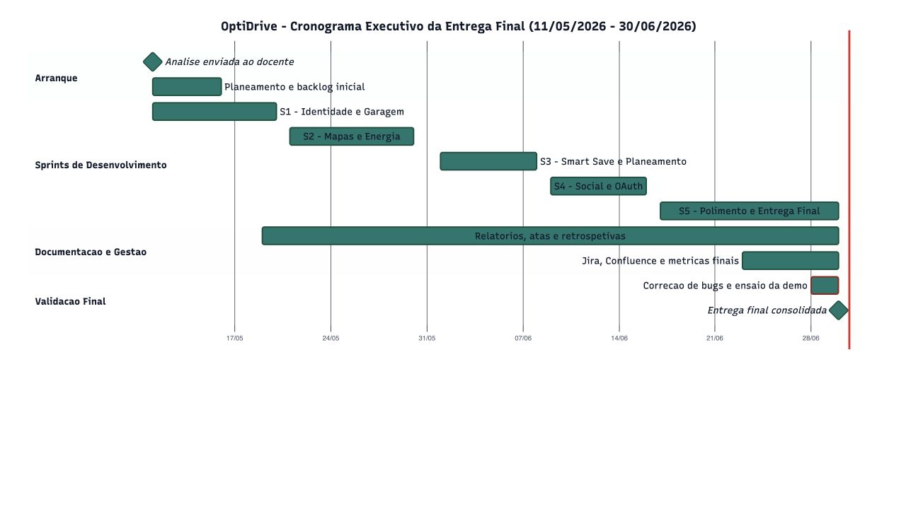

# OptiDrive - Análise e Especificação de Requisitos

| Campo | Valor |
| --- | --- |
| Curso | Engenharia de Software Aplicada |
| Ano letivo | 2025/2026 |
| Projeto | OptiDrive |
| Documento | Análise e Especificação de Requisitos |
| Versão | 2.1 |
| Data | 30/06/2026 |
| Equipa | Alexandre Miguel |
| Estado | Pronto para publicação |

## Versões do Trabalho

| Versão | Data | Autor | Alterações |
| --- | --- | --- | --- |
| 1.0 | 10/06/2026 | Alexandre Miguel | Primeira versão com visão, módulos e requisitos iniciais |
| 1.5 | 17/06/2026 | Alexandre Miguel | Inclusão de garagem, planeamento, postos, social e Docker |
| 2.0 | 24/06/2026 | Alexandre Miguel | Revisão segundo feedback docente: plano 3.5, módulos, requisitos, atores, use cases, rastreabilidade e MoSCoW |
| 2.1 | 24/06/2026 | Alexandre Miguel | Consolidação final em 5 sprints, com desenho detalhado, atas e rastreabilidade documental |

## 1. Introdução

### 1.1 Missão

O OptiDrive tem como missão ajudar condutores a planear deslocações rodoviárias com maior previsibilidade de custo, autonomia e colaboração. A plataforma centraliza garagem, níveis de combustível/carga, rotas, postos, carregadores elétricos, portagens e viagens sociais num único sistema web.

A proposta de valor combina três dimensões:

- Planeamento inteligente: cálculo de rota, consumo, custos, reforços e chegada com reserva.
- Gestão operacional: garagem com histórico por veículo, manutenção e níveis atuais.
- Colaboração social: perfis, contactos, mensagens e viagens conjuntas.

### 1.2 Ponto de Situação

A aplicação está implementada em `ASP.NET Core MVC (.NET 8)`, com Razor Views, JavaScript, CSS, SQLite via Entity Framework Core, Docker, autenticação local, MFA TOTP, OAuth configurável e integrações com mapas, postos de combustível e carregadores elétricos.

O produto já permite apresentar fluxos reais de utilização: criação de conta, ativação de Authenticator, garagem, planeamento de rota, seleção de veículo, postos junto à rota, gravação/aplicação da viagem, histórico do veículo e interação social.

## 2. Documentação do Projeto

| Fase | Documento | Objetivo | Estado |
| --- | --- | --- | --- |
| Planeamento | Análise e Especificação de Requisitos | Definir missão, módulos, requisitos, atores, use cases e rastreabilidade | Concluído |
| Arquitetura | Desenho de Alto Nível | Descrever arquitetura lógica, física, UI, persistência e normas | Concluído |
| Sprint 1 | Desenho Detalhado Sprint 1 | Detalhar identidade, segurança e garagem | Concluído |
| Sprint 2 | Desenho Detalhado Sprint 2 | Detalhar mapas, postos, carregadores e rotas | Concluído |
| Sprint 3 | Desenho Detalhado Sprint 3 | Detalhar Smart Save, autonomia, reforços e histórico operacional | Concluído |
| Sprint 4 | Desenho Detalhado Sprint 4 | Detalhar social, OAuth, MFA e colaboração entre utilizadores | Concluído |
| Sprint 5 | Desenho Detalhado Sprint 5 | Detalhar i18n, tema, Docker, readiness, dados realistas e entrega | Concluído |
| Gestão | Atas de Sprint 1 a 5 | Registar decisões, ações, pendentes e validações | Concluído |
| Qualidade | Plano de Testes e Validação | Documentar testes, critérios e evidência operacional | Concluído |

### 2.1 Histórico e Motivação

O problema identificado é a fragmentação da informação necessária para planear viagens: mapas mostram rotas, apps de combustível mostram preços, apps de carregamento mostram postos elétricos, e a informação real do carro fica separada. Como resultado, o condutor decide muitas vezes sem conhecer o custo final, autonomia de chegada, impacto de portagens ou necessidade de reforço a meio da viagem.

O OptiDrive nasce como resposta a esse problema, juntando dados do veículo, rota, energia e contexto social. A abordagem escolhida privilegia uma aplicação web acessível, com persistência local para apresentação académica e arquitetura preparada para evoluir para produção.

## 3. Plano de Projeto

### 3.1 Metodologia

Foi usada uma abordagem incremental inspirada em Scrum, organizada em cinco sprints funcionais. A divisão em 5 sprints permite evidenciar evolução progressiva sem fragmentar demasiado a entrega: base técnica, planeamento, otimização, colaboração social e fecho operacional.

### 3.2 Equipa e Responsabilidades

| Papel | Responsável | Responsabilidades |
| --- | --- | --- |
| Product Owner académico | Alexandre Miguel | Definição da visão, prioridades, validação funcional |
| Scrum Master | Alexandre Miguel | Gestão de backlog, atas, planeamento e impedimentos |
| Desenvolvimento full-stack | Alexandre Miguel | ASP.NET Core MVC, Razor, JavaScript, CSS, EF Core, Docker |
| Qualidade e documentação | Alexandre Miguel | Testes, relatórios, Confluence e Jira |
| Stakeholder académico | Docente | Feedback, validação dos entregáveis e critérios de avaliação |

### 3.3 Ferramentas

| Ferramenta | Utilização |
| --- | --- |
| ASP.NET Core MVC / .NET 8 | Implementação web principal |
| Razor Views | Interface servidor-cliente |
| JavaScript | Mapa, interação de formulários e internacionalização |
| CSS | Design responsivo, tema claro/escuro e identidade visual |
| SQLite / EF Core | Persistência local e Docker |
| Docker Compose | Execução reproduzível em MacBook |
| Jira | Backlog, sprints, tarefas e acompanhamento |
| Confluence | Publicação dos relatórios |
| Google Maps APIs | Mapas, geocoding e direções |
| OpenChargeMap | Carregadores elétricos |

### 3.4 Controlo de Versões

O código está organizado num repositório Git com separação clara entre aplicação, testes, documentação e scripts de publicação. A estrutura principal é:

| Pasta/Ficheiro | Função |
| --- | --- |
| `OptiDrive.Web` | Aplicação ASP.NET Core MVC |
| `OptiDrive.Web.Tests` | Testes automatizados |
| `docs/reports` | Relatórios para Confluence |
| `docs/jira` | Presets e artefactos Jira |
| `tools` | Scripts de publicação e automação |
| `docker-compose.yml` | Orquestração local |
| `.env.example` | Variáveis de configuração |

### 3.5 Estrutura do Projeto e Planeamento de Alto Nível

O planeamento foi consolidado em exatamente 5 sprints, garantindo que cada incremento tem objetivo funcional, evidência técnica, relatório de desenho detalhado e ata correspondente.

| ID | Sprint | Tarefa | Módulo | Duração | Dependências | Entregável |
| --- | --- | --- | --- | --- | --- | --- |
| T01 | Sprint 1 | Criar solução ASP.NET Core MVC e navegação base | M01/M07 | 2 dias | - | App web executável |
| T02 | Sprint 1 | Implementar login local, hashing, sessão e registo | M01 | 3 dias | T01 | Identidade local |
| T03 | Sprint 1 | Implementar MFA TOTP, QR code e recovery codes | M01 | 2 dias | T02 | Authenticator funcional |
| T04 | Sprint 1 | Modelar garagem, veículos, autonomia inicial e histórico | M02 | 4 dias | T01 | Garagem operacional |
| T05 | Sprint 2 | Integrar catálogo de marcas/modelos e inferência de combustível | M02 | 2 dias | T04 | Formulário inteligente |
| T06 | Sprint 2 | Integrar postos de combustível e filtros por marca/energia | M04 | 3 dias | T01 | Mapa de postos |
| T07 | Sprint 2 | Integrar OpenChargeMap para carregadores elétricos | M04 | 2 dias | T06 | Postos EV no mapa |
| T08 | Sprint 2 | Implementar geocoding, Google Maps e Directions API | M03 | 3 dias | T01 | Rotas reais |
| T09 | Sprint 2 | Implementar evitar portagens, itinerário e custo estimado | M03 | 2 dias | T08 | Planeamento operacional |
| T10 | Sprint 3 | Implementar Smart Save, consumo por velocidade e autonomia de chegada | M05 | 4 dias | T04,T06,T08 | Cálculo de autonomia |
| T11 | Sprint 3 | Sugerir reforços de combustível/carga durante a rota | M05/M04 | 3 dias | T10 | Paragens inteligentes |
| T12 | Sprint 3 | Guardar/aplicar viagens ao veículo e atualizar nível/histórico | M02/M05 | 2 dias | T10 | Ciclo rota -> garagem |
| T13 | Sprint 4 | Implementar perfis sociais, contactos e mensagens | M06 | 4 dias | T02 | Social funcional |
| T14 | Sprint 4 | Implementar viagens colaborativas, participantes e split de custos | M06/M05 | 3 dias | T13,T10 | Viagens em grupo |
| T15 | Sprint 4 | Preparar OAuth Google, Microsoft, Apple fallback e segurança de perfil | M01 | 3 dias | T02,T03 | Login federado configurável |
| T16 | Sprint 5 | Adicionar tema claro/escuro, português/inglês e polish visual | M07 | 2 dias | T01-T15 | UX final |
| T17 | Sprint 5 | Configurar Docker, SQLite persistente, healthcheck e backoffice | M07 | 3 dias | T01-T15 | Entrega reproduzível |
| T18 | Sprint 5 | Criar dataset realista com utilizadores, veículos, mensagens e viagens | M02/M06 | 2 dias | T13,T14 | Produto povoado para apresentação |
| T19 | Sprint 5 | Criar relatórios, atas, Jira e publicação Confluence | M07 | 4 dias | T01-T18 | Pacote académico completo |
| T20 | Sprint 5 | Corrigir bugs finais, validar fluxos críticos e preparar demonstração | M07/M01-M06 | 3 dias | T16-T19 | Entrega validada em 30/06 |

_Figura 3.5 - Gráfico de Gantt do Projeto_

## 4. Especificação de Requisitos

### 4.1 Módulos

| ID | Módulo | Designação | Descrição |
| --- | --- | --- | --- |
| M01 | Identidade e Segurança | Gestão de acesso, sessão e proteção | Login local, registo, OAuth, MFA, recovery codes e perfil |
| M02 | Garagem e Veículos | Gestão operacional dos veículos | Marca, modelo, consumo, autonomia, combustível/carga, manutenção e histórico |
| M03 | Planeamento Inteligente | Rotas e itinerários | Origem/destino via mapas, pontos opcionais, instruções, distância, duração e portagens |
| M04 | Postos e Energia | Rede de abastecimento e carregamento | Postos de combustível, carregadores EV, preços, marcas e filtros por rota |
| M05 | Otimização Smart Save | Decisão económica e autonomia | Consumo por velocidade, reforços, chegada com reserva e custo estimado |
| M06 | Social e Viagens Colaborativas | Colaboração entre utilizadores | Perfis, contactos, mensagens, grupos, viagens conjuntas e split de custos |
| M07 | Administração e Observabilidade | Operação, qualidade e entrega | Backoffice, healthcheck, sincronizações, i18n, tema e documentação |

### 4.2 Requisitos Funcionais

| ID | Módulo | Prioridade | Requisito |
| --- | --- | --- | --- |
| RF-M01-01 | M01 | Must | O sistema deverá permitir criação de conta local com nome, email e palavra-passe. |
| RF-M01-02 | M01 | Must | O sistema deverá autenticar utilizadores locais com hashing seguro de palavra-passe. |
| RF-M01-03 | M01 | Must | O sistema deverá permitir iniciar sessão com Google OAuth quando configurado. |
| RF-M01-04 | M01 | Should | O sistema deverá permitir iniciar sessão com Microsoft OAuth quando configurado. |
| RF-M01-05 | M01 | Could | O sistema deverá permitir iniciar sessão com Apple OAuth quando configurado. |
| RF-M01-06 | M01 | Must | O sistema deverá permitir ativar MFA TOTP através de Microsoft Authenticator, Google Authenticator ou app compatível. |
| RF-M01-07 | M01 | Should | O sistema deverá gerar e validar códigos de recuperação para MFA. |
| RF-M02-01 | M02 | Must | O sistema deverá permitir criar, editar e consultar veículos na garagem. |
| RF-M02-02 | M02 | Must | O sistema deverá associar marca, modelo, ano, combustível, consumo, autonomia e matrícula a cada veículo. |
| RF-M02-03 | M02 | Must | O sistema deverá guardar nível atual de combustível ou carga por veículo. |
| RF-M02-04 | M02 | Must | O sistema deverá permitir registar abastecimentos e carregamentos. |
| RF-M02-05 | M02 | Must | O sistema deverá refletir viagens assumidas no nível do veículo e no histórico. |
| RF-M02-06 | M02 | Should | O sistema deverá apresentar ficha dedicada por veículo, com manutenção, pneus, seguro e inspeção. |
| RF-M03-01 | M03 | Must | O sistema deverá permitir planear uma rota com origem e destino escritos pelo utilizador. |
| RF-M03-02 | M03 | Should | O sistema deverá permitir pontos intermédios opcionais sem os tornar obrigatórios. |
| RF-M03-03 | M03 | Must | O sistema deverá usar Google Maps para geocoding, mapa visual e instruções de rota quando configurado. |
| RF-M03-04 | M03 | Should | O sistema deverá recalcular a rota quando o utilizador optar por evitar portagens. |
| RF-M03-05 | M03 | Must | O sistema deverá apresentar distância, duração, instruções, custo estimado e chegada prevista. |
| RF-M04-01 | M04 | Must | O sistema deverá consultar e apresentar postos de combustível disponíveis. |
| RF-M04-02 | M04 | Should | O sistema deverá agregar combustíveis diferentes no mesmo posto sempre que existam dados disponíveis. |
| RF-M04-03 | M04 | Must | O sistema deverá apresentar carregadores elétricos obtidos por OpenChargeMap. |
| RF-M04-04 | M04 | Should | O sistema deverá filtrar postos por combustível/energia compatível com o veículo selecionado. |
| RF-M04-05 | M04 | Could | O sistema deverá filtrar postos por marca, como Galp, Repsol, Shell, BP ou outras. |
| RF-M04-06 | M04 | Should | O sistema deverá apresentar preferencialmente postos próximos da rota calculada. |
| RF-M05-01 | M05 | Must | O sistema deverá estimar consumo com base no veículo selecionado e na distância da rota. |
| RF-M05-02 | M05 | Should | O sistema deverá ajustar consumo previsto de acordo com a velocidade média. |
| RF-M05-03 | M05 | Must | O sistema deverá calcular se a autonomia disponível é suficiente para chegar ao destino. |
| RF-M05-04 | M05 | Must | O sistema deverá sugerir paragens de abastecimento ou carregamento quando a autonomia não for suficiente. |
| RF-M05-05 | M05 | Should | O sistema deverá garantir margem mínima de chegada em vez de estimar chegada a 0%. |
| RF-M05-06 | M05 | Should | O sistema deverá comparar custo rápido e custo económico através do Smart Save. |
| RF-M06-01 | M06 | Must | O sistema deverá permitir cada utilizador manter um perfil social. |
| RF-M06-02 | M06 | Must | O sistema deverá permitir adicionar contactos de confiança. |
| RF-M06-03 | M06 | Must | O sistema deverá permitir trocar mensagens diretas entre utilizadores. |
| RF-M06-04 | M06 | Should | O sistema deverá permitir criar viagens colaborativas com participantes. |
| RF-M06-05 | M06 | Should | O sistema deverá permitir iniciar viagens em conjunto e apresentar estado ativo. |
| RF-M06-06 | M06 | Could | O sistema deverá permitir dividir custos de combustível, carregamento e portagens entre participantes. |
| RF-M07-01 | M07 | Must | O sistema deverá disponibilizar backoffice com estado de integrações e sincronizações. |
| RF-M07-02 | M07 | Must | O sistema deverá disponibilizar endpoint `/health` com estado operacional. |
| RF-M07-03 | M07 | Should | O sistema deverá permitir alternar entre modo claro e modo escuro. |
| RF-M07-04 | M07 | Should | O sistema deverá permitir alternar entre português e inglês. |
| RF-M07-05 | M07 | Must | O sistema deverá executar em Docker com base de dados persistente. |

### 4.3 Atores

| ID | Ator | Tipo | Descrição |
| --- | --- | --- | --- |
| A01 | Visitante | Humano | Pessoa que acede ao site antes de criar conta ou iniciar sessão |
| A02 | Condutor autenticado | Humano | Utilizador principal que gere veículos, rotas e custos |
| A03 | Passageiro/participante | Humano | Utilizador que participa em viagens colaborativas |
| A04 | Administrador | Humano | Utilizador com acesso ao backoffice e readiness |
| A05 | Fornecedor de mapas | Sistema externo | Google Maps/Geocoding/Directions |
| A06 | Fornecedor de energia | Sistema externo | Fontes de postos de combustível e OpenChargeMap |
| A07 | Fornecedor de identidade | Sistema externo | Google, Microsoft e Apple OAuth |

### 4.4 Use Cases

| ID | Nome | Atores | Módulos |
| --- | --- | --- | --- |
| UC-01 | Criar conta local | A01 | M01 |
| UC-02 | Entrar com fornecedor externo | A01, A07 | M01 |
| UC-03 | Ativar Authenticator | A02 | M01 |
| UC-04 | Criar veículo | A02 | M02 |
| UC-05 | Abrir ficha de veículo | A02 | M02 |
| UC-06 | Abastecer ou carregar veículo | A02 | M02 |
| UC-07 | Planear rota com mapa | A02, A05 | M03 |
| UC-08 | Evitar portagens | A02, A05 | M03 |
| UC-09 | Consultar postos junto à rota | A02, A06 | M04 |
| UC-10 | Filtrar postos por combustível e marca | A02 | M04 |
| UC-11 | Calcular Smart Save | A02 | M05 |
| UC-12 | Sugerir reforço de autonomia | A02 | M05 |
| UC-13 | Guardar e aplicar rota ao veículo | A02 | M02, M03, M05 |
| UC-14 | Editar perfil social | A02 | M06 |
| UC-15 | Enviar mensagem | A02, A03 | M06 |
| UC-16 | Criar viagem colaborativa | A02, A03 | M06 |
| UC-17 | Consultar backoffice | A04 | M07 |
| UC-18 | Validar saúde da aplicação | A04 | M07 |
| UC-19 | Alternar tema e idioma | A02 | M07 |

### 4.5 Descrição Resumida por Módulo

| Módulo | Use cases principais | Resultado esperado |
| --- | --- | --- |
| M01 | UC-01, UC-02, UC-03 | O utilizador entra de forma segura e pode proteger a conta com MFA |
| M02 | UC-04, UC-05, UC-06, UC-13 | A garagem apresenta veículos reais, níveis atuais e histórico operacional |
| M03 | UC-07, UC-08, UC-13 | O condutor calcula rotas reais e pode evitar portagens |
| M04 | UC-09, UC-10 | O mapa mostra apenas postos relevantes e filtráveis |
| M05 | UC-11, UC-12, UC-13 | O sistema estima consumo, reforços e custo total com margem de chegada |
| M06 | UC-14, UC-15, UC-16 | A parte social permite perfis, mensagens e viagens em conjunto |
| M07 | UC-17, UC-18, UC-19 | O produto tem backoffice, healthcheck, Docker, i18n e tema |

### 4.6 Matriz de Rastreabilidade Geral

Legenda MoSCoW: Must = obrigatório, Should = importante, Could = desejável, Won't = fora do âmbito atual.

| Requisito | Prioridade | Use cases |
| --- | --- | --- |
| RF-M01-01 | Must | UC-01 |
| RF-M01-02 | Must | UC-01 |
| RF-M01-03 | Must | UC-02 |
| RF-M01-04 | Should | UC-02 |
| RF-M01-05 | Could | UC-02 |
| RF-M01-06 | Must | UC-03 |
| RF-M01-07 | Should | UC-03 |
| RF-M02-01 | Must | UC-04, UC-05 |
| RF-M02-02 | Must | UC-04, UC-05 |
| RF-M02-03 | Must | UC-05, UC-06, UC-13 |
| RF-M02-04 | Must | UC-06 |
| RF-M02-05 | Must | UC-13 |
| RF-M02-06 | Should | UC-05 |
| RF-M03-01 | Must | UC-07 |
| RF-M03-02 | Should | UC-07 |
| RF-M03-03 | Must | UC-07 |
| RF-M03-04 | Should | UC-08 |
| RF-M03-05 | Must | UC-07, UC-13 |
| RF-M04-01 | Must | UC-09 |
| RF-M04-02 | Should | UC-09 |
| RF-M04-03 | Must | UC-09 |
| RF-M04-04 | Should | UC-10 |
| RF-M04-05 | Could | UC-10 |
| RF-M04-06 | Should | UC-09 |
| RF-M05-01 | Must | UC-11 |
| RF-M05-02 | Should | UC-11 |
| RF-M05-03 | Must | UC-11, UC-12 |
| RF-M05-04 | Must | UC-12 |
| RF-M05-05 | Should | UC-12 |
| RF-M05-06 | Should | UC-11 |
| RF-M06-01 | Must | UC-14 |
| RF-M06-02 | Must | UC-14, UC-15 |
| RF-M06-03 | Must | UC-15 |
| RF-M06-04 | Should | UC-16 |
| RF-M06-05 | Should | UC-16 |
| RF-M06-06 | Could | UC-16 |
| RF-M07-01 | Must | UC-17 |
| RF-M07-02 | Must | UC-18 |
| RF-M07-03 | Should | UC-19 |
| RF-M07-04 | Should | UC-19 |
| RF-M07-05 | Must | UC-18 |

## 5. Requisitos de Qualidade

| ID | Categoria ISO 25010 | Requisito de qualidade | Medida/critério |
| --- | --- | --- | --- |
| RQ-01 | Usabilidade | A interface deverá ser clara em desktop e mobile | Navegação por abas e layout responsivo |
| RQ-02 | Usabilidade | O sistema deverá suportar português e inglês | Alternância visível e persistente no browser |
| RQ-03 | Eficiência | O mapa deverá limitar postos ao contexto da rota | Filtragem por proximidade e tipo de energia |
| RQ-04 | Fiabilidade | O sistema deverá manter dados persistentes em Docker | Volume SQLite em `/app/data` |
| RQ-05 | Segurança | O sistema deverá proteger passwords com hashing seguro | PBKDF2 e password sem texto simples |
| RQ-06 | Segurança | O sistema deverá suportar autenticação em dois fatores | TOTP + recovery codes |
| RQ-07 | Compatibilidade | O sistema deverá integrar fornecedores externos de forma configurável | Variáveis `.env` e readiness |
| RQ-08 | Manutenibilidade | O sistema deverá separar controllers, services, models e views | Estrutura ASP.NET Core MVC modular |
| RQ-09 | Portabilidade | O sistema deverá correr localmente e em Docker | `dotnet run` e `docker compose up -d` |
| RQ-10 | Observabilidade | O sistema deverá expor estado operacional | `/health` e backoffice |

## 6. Critérios de Aceitação Globais

| Critério | Evidência |
| --- | --- |
| A aplicação inicia localmente | `dotnet run --project OptiDrive.Web/OptiDrive.Web.csproj` |
| A aplicação inicia em Docker | `docker compose up -d --build` |
| A autenticação local funciona | Login com utilizador existente ou conta criada |
| O Authenticator funciona | QR code, código TOTP e recovery codes |
| A garagem é operacional | Criar/abrir veículo, atualizar nível e histórico |
| O planeamento é operacional | Calcular rota, visualizar mapa, instruções e custo |
| O Smart Save é operacional | Reforços e margem de chegada calculados |
| O social é operacional | Perfil, mensagens e viagens colaborativas |
| A documentação está alinhada | Relatórios publicados/ontos para Confluence |
