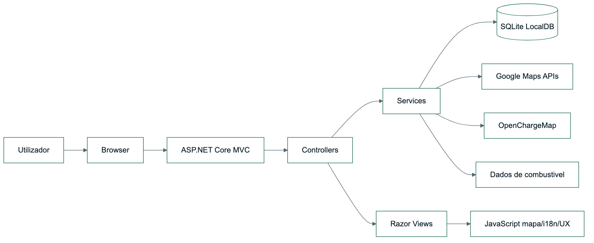
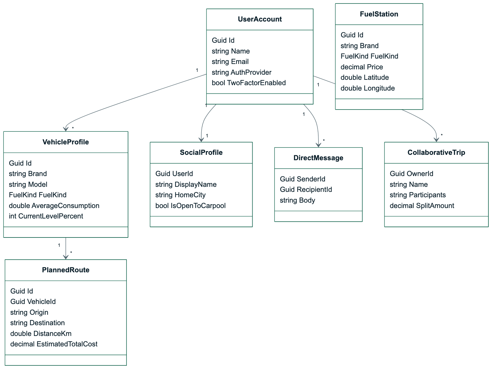
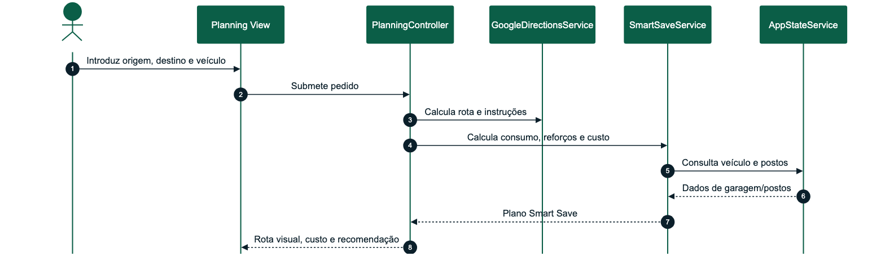
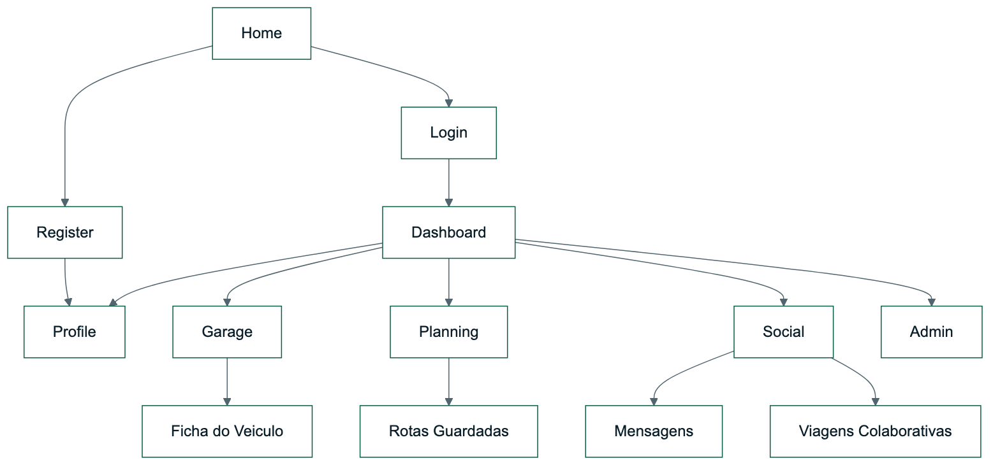
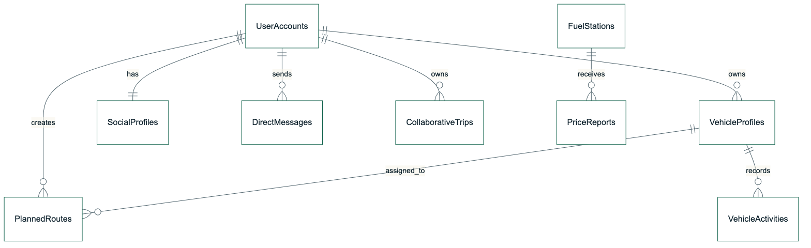
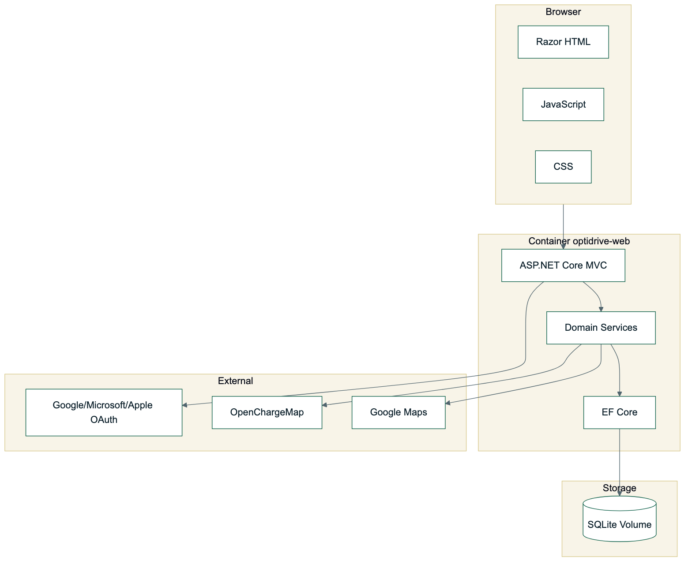
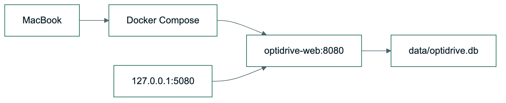

# OptiDrive - Desenho de Alto Nível

| Campo | Valor |
| --- | --- |
| Projeto | OptiDrive |
| Documento | Desenho de Alto Nível |
| Versão | 2.0 |
| Data | 30/06/2026 |
| Estado | Pronto para publicação |
| Stack | ASP.NET Core MVC, Razor, JavaScript, CSS, EF Core, SQLite, Docker |

## Versões do Trabalho

| Versão | Data | Autor | Alterações |
| --- | --- | --- | --- |
| 1.0 | 10/06/2026 | Alexandre Miguel | Estrutura inicial de arquitetura, persistência e navegação |
| 1.5 | 17/06/2026 | Alexandre Miguel | Inclusão de Docker, SQLite, mapas e integrações externas |
| 2.0 | 24/06/2026 | Alexandre Miguel | Revisão final com matriz de acessos, processos, deployment e normas de codificação |

## Sumário Executivo

O OptiDrive foi desenhado como uma aplicação web modular em ASP.NET Core MVC, preparada para correr localmente e em Docker. A arquitetura privilegia uma divisão clara entre apresentação, controllers, serviços de domínio, persistência local e integrações externas.

O sistema suporta login local, Google/Microsoft/Apple OAuth configurável, MFA TOTP, garagem por veículo, planeamento com Google Maps, postos de combustível, carregadores elétricos, Smart Save, viagens colaborativas, tema claro/escuro, português/inglês e backoffice de readiness.

## 1. Introdução

Este documento descreve a arquitetura global do OptiDrive e serve de ponte entre os requisitos funcionais e o desenho detalhado por sprint. O foco está na decomposição modular, nos componentes técnicos, nos fluxos principais e nas decisões de alto nível.

## 2. Desenho de Alto Nível

### 2.1 Arquitetura Geral

_Figura 2.1 - Arquitetura Geral_

A aplicação usa um monólito modular: a implantação é simples, mas o código está separado por responsabilidades para manter manutenibilidade.

### 2.2 Arquitetura Lógica

| Camada | Componentes | Responsabilidade |
| --- | --- | --- |
| Apresentação | Razor Views, CSS, JavaScript | Interface, formulários, mapa, tema, idioma |
| Controllers MVC | `HomeController`, `GarageController`, `PlanningController`, `SocialController`, `ProfileController`, `AdminController` | Receber ações do utilizador e devolver views/respostas |
| Aplicação/Serviços | `AppStateService`, `SmartSaveService`, serviços externos | Regras de negócio, sincronização, cálculo e orquestração |
| Domínio | `UserAccount`, `VehicleProfile`, `PlannedRoute`, `FuelStation`, `CollaborativeTrip` | Entidades principais do sistema |
| Persistência | `OptiDriveDbContext`, SQLite, bootstrap | Guardar estado local e dados realistas |
| Integração | Google Maps, OpenChargeMap, catálogo veículos, OAuth | Fornecedores externos configuráveis |

### 2.3 Diagrama de Classes de Desenho

_Figura 2.3 - Diagrama de Classes de Desenho_

## 3. Processos de Negócio

### 3.1 Identificação de Processos

| ID | Processo | Entrada | Saída |
| --- | --- | --- | --- |
| P01 | Autenticar utilizador | Credenciais locais ou OAuth | Sessão iniciada ou MFA pendente |
| P02 | Ativar Authenticator | QR code e código TOTP | Conta com 2FA ativo |
| P03 | Gerir veículo | Dados técnicos e nível atual | Veículo persistido na garagem |
| P04 | Planear rota | Veículo, origem, destino, opções | Rota, mapa, custo e instruções |
| P05 | Otimizar paragem | Rota, autonomia, postos | Reforço recomendado |
| P06 | Aplicar viagem | Rota guardada e veículo | Histórico e nível atualizado |
| P07 | Criar viagem social | Rota/veículo, participantes | Viagem colaborativa ativa/agendada |

### 3.2 Processo: Planeamento de Rota

_Figura 3.2 - Processo - Planeamento de Rota_

## 4. Interface de Utilizador

### 4.1 Introdução

A interface foi desenhada como cockpit de mobilidade: navegação por áreas principais, painéis com métricas, cards de veículo, mapa central e linguagem visual consistente. O sistema suporta tema claro/escuro e alternância PT/EN.

### 4.2 Interfaces Principais

| Ecrã | Objetivo | Elementos principais |
| --- | --- | --- |
| Home | Apresentar proposta de valor | CTA de login/registo, módulos e benefícios |
| Login/Registo | Acesso à plataforma | Login local, Google, Microsoft, Apple, criação de conta |
| Perfil | Identidade e segurança | OAuth configurado, 2FA, QR code, recovery codes |
| Garagem | Gestão de veículos | Lista de carros, ficha dedicada, abastecer/carregar, histórico |
| Planeamento | Rota e mapa | Origem/destino, veículo, postos próximos, instruções e Smart Save |
| Social | Comunidade | Perfil, contactos, mensagens e viagens colaborativas |
| Backoffice | Readiness | Integrações, sincronizações, health e postos |

### 4.3 Normas de UI

| Norma | Aplicação |
| --- | --- |
| Hierarquia visual forte | Títulos curtos, painéis e métricas |
| Feedback imediato | Mensagens `TempData`, pills de estado e readiness |
| Responsividade | Grids adaptáveis para desktop e mobile |
| Acessibilidade básica | Labels, botões claros e contraste consistente |
| Internacionalização | Dicionário JS para PT/EN |
| Tema | Variáveis CSS e alternância claro/escuro |

### 4.4 Diagrama de Navegação

_Figura 4.4 - Diagrama de Navegação_

### 4.5 Matriz de Acesso

| Área | Visitante | Condutor | Participante | Administrador |
| --- | --- | --- | --- | --- |
| Home | Ler | Ler | Ler | Ler |
| Login/Registo | Usar | - | - | - |
| Dashboard | - | Usar | Usar | Usar |
| Perfil | - | Gerir próprio | Gerir próprio | Gerir próprio |
| Garagem | - | Gerir própria | Ver partilhados | Gerir própria |
| Planeamento | - | Criar/aplicar | Participar | Criar/aplicar |
| Social | - | Usar | Usar | Usar |
| Backoffice | - | - | - | Gerir |
| Healthcheck | - | - | - | Consultar |

## 5. Persistência

### 5.1 Introdução

A persistência usa SQLite como LocalDB. Em execução local fica em `OptiDrive.Web/App_Data/optidrive.db`; em Docker fica em `/app/data/optidrive.db`, suportado por volume.

### 5.2 Modelo Relacional Resumido

_Figura 5.2 - Modelo Relacional Resumido_

### 5.3 Entidades Persistidas

| Entidade | Finalidade |
| --- | --- |
| `UserAccount` | Identidade, OAuth, MFA, role e sessão |
| `SocialProfile` | Perfil social, bio, cidade e preferências |
| `VehicleProfile` | Dados técnicos, autonomia e manutenção |
| `VehicleActivity` | Histórico de abastecimentos, cargas e viagens |
| `FuelStation` | Postos de combustível e carregadores EV |
| `PlannedRoute` | Rotas calculadas e associadas a veículos |
| `DirectMessage` | Conversas entre utilizadores |
| `CollaborativeTrip` | Viagens em grupo e split de custos |

## 6. Arquitetura Física

### 6.1 Componentes

_Figura 6.1 - Componentes_

### 6.2 Deployment

_Figura 6.2 - Deployment_

## 7. Normas de Codificação

| Norma | Aplicação |
| --- | --- |
| Controllers leves | Controllers delegam regras para services |
| Services com responsabilidade clara | Smart Save, estado, APIs externas e autenticação isolados |
| Modelos tipados | Enums para combustível, portagens, roles e estados |
| Views Razor sem lógica pesada | Views focadas em renderização e formulários |
| JavaScript progressivo | Mapa e i18n sem bloquear navegação base |
| Configuração por ambiente | OAuth/APIs por `appsettings`, `.env` e Docker |
| Testabilidade | Serviços principais cobertos por testes automatizados |

## 8. Decisões de Arquitetura

| Decisão | Justificação |
| --- | --- |
| ASP.NET Core MVC | Adequado à cadeira, robusto para produto web e compatível com Razor |
| SQLite LocalDB | Simples, persistente, portátil e adequado para apresentação local |
| Monólito modular | Menos complexidade operacional e módulos bem separados no código |
| OAuth configurável | Produto real sem guardar credenciais no código |
| Docker Compose | Reprodutibilidade em MacBook e entrega fácil |
| Backoffice readiness | Mostra maturidade operacional e estado das integrações |
