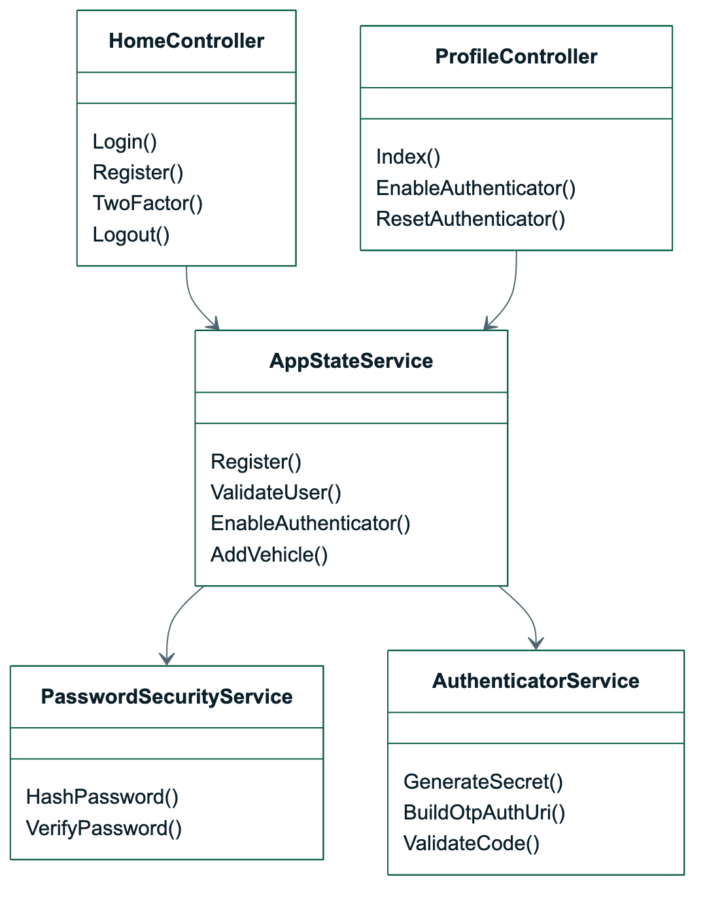
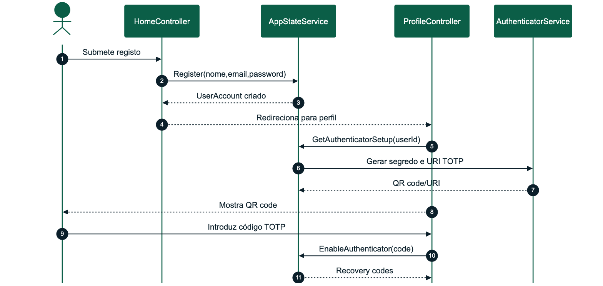

# OptiDrive - Desenho Detalhado Sprint 1

| Campo | Valor |
| --- | --- |
| Sprint | Sprint 1 |
| Tema | Identidade, segurança e garagem |
| Período | 11/05/2026 a 20/05/2026 |
| Estado | Concluído |
| Módulos | M01 Identidade e Segurança, M02 Garagem e Veículos |

## Versões do Trabalho

| Versão | Data | Autor | Alterações |
| --- | --- | --- | --- |
| 1.0 | 11/05/2026 | Alexandre Miguel | Definição da sprint, requisitos implementados e componentes base |
| 1.1 | 20/05/2026 | Alexandre Miguel | Inclusão de testes, manual de utilização e manual técnico |
| 1.2 | 24/06/2026 | Alexandre Miguel | Revisão estrutural segundo templates académicos: cobertura de testes e requisitos adiados |

## Sumário Executivo

A Sprint 1 estabeleceu a base técnica e funcional do OptiDrive. Foram implementados a solução ASP.NET Core MVC, navegação principal, autenticação local, criação de conta, sessão, estrutura de perfil, garagem inicial e modelos de domínio.

## 1. Requisitos Funcionais Implementados

| Requisito | Descrição | Estado |
| --- | --- | --- |
| RF-M01-01 | O sistema deverá permitir criação de conta local | Implementado |
| RF-M01-02 | O sistema deverá autenticar utilizadores locais com hashing seguro | Implementado |
| RF-M01-06 | O sistema deverá permitir ativar MFA TOTP | Implementado |
| RF-M01-07 | O sistema deverá gerar códigos de recuperação | Implementado |
| RF-M02-01 | O sistema deverá permitir criar, editar e consultar veículos | Implementado |
| RF-M02-02 | O sistema deverá associar dados técnicos ao veículo | Implementado |
| RF-M02-03 | O sistema deverá guardar nível atual de combustível/carga | Implementado |

## 2. Componentes Técnicos

| Componente | Ficheiros principais | Responsabilidade |
| --- | --- | --- |
| Identidade | `HomeController`, `ProfileController` | Login, registo, MFA, sessão e logout |
| Segurança | `PasswordSecurityService`, `AuthenticatorService` | Hashing, validação TOTP, recovery codes |
| Estado | `AppStateService` | Repositório aplicacional e persistência |
| Garagem | `GarageController`, `VehicleProfile` | Gestão de veículos e ficha operacional |
| UI | Views `Home`, `Profile`, `Garage` | Interface de acesso, perfil e garagem |

## 3. Diagrama de Classes Detalhado



_Figura 3 - Diagrama de Classes Detalhado_

## 4. Processo: Criar Conta e Ativar MFA



_Figura 4 - Processo - Criar Conta e Ativar MFA_

## 5. Interface Implementada

| Ecrã | Elementos |
| --- | --- |
| Login | Email, password, mensagens de erro, links para registo |
| Registo | Nome, email, password, criação de conta e onboarding para perfil |
| Perfil | Estado OAuth, estado 2FA, QR code, recovery codes e reset |
| Garagem | Lista de veículos, ficha do veículo, nível, histórico e manutenção |

## 6. Requisitos Previstos Não Implementados

| Requisito | Decisão | Justificação |
| --- | --- | --- |
| Recuperação de password por email | Adiado para evolução pós-entrega | A apresentação local não depende de SMTP real; a segurança foi coberta por login local, hashing e MFA |
| OAuth externo completo | Transferido para Sprint 3 | A prioridade inicial foi estabilizar identidade local, sessão e Authenticator antes de fornecedores externos |
| Importação automática de consumo por API de veículos | Mantido como configurável/manual | As APIs abertas de veículos não garantem cobertura completa por modelo; a garagem permite consumo editável |

## 7. Testes

### 7.1 Testes Unitários

| Caso | Procedimento | Resultado esperado |
| --- | --- | --- |
| TU-01 | Registar utilizador novo | Utilizador criado com password hash |
| TU-02 | Tentar registar email duplicado | Exceção controlada |
| TU-03 | Validar password correta | Login aceite |
| TU-04 | Validar password incorreta | Login rejeitado |
| TU-05 | Criar veículo | Veículo associado ao owner |

### 7.2 Cobertura de Testes da Sprint

| Tipo de teste | Cobertura | Resultado |
| --- | --- | --- |
| Unitários | Password hashing, validação de utilizador, criação de veículo | Passou |
| Integração | `HomeController`, `ProfileController`, `GarageController` com `AppStateService` | Passou |
| Regressão | Login local e criação de garagem após alterações de perfil | Passou |
| Funcionalidade | Fluxo registo -> perfil -> MFA -> garagem | Passou |
| Segurança | Password não guardada em texto limpo, TOTP e recovery codes | Passou |
| Compatibilidade | Execução local em macOS e Docker preparado | Passou |
| Aceitação | Demonstração manual da criação de conta e veículo | Passou |

### 7.3 Testes de Aceitação

| Caso | Passos | Aceitação |
| --- | --- | --- |
| TA-01 | Criar conta local e abrir perfil | Conta entra e mostra setup Authenticator |
| TA-02 | Adicionar veículo à garagem | Veículo aparece na lista e ficha |
| TA-03 | Atualizar nível do veículo | Valor persiste após refresh |

## 8. Manual de Utilização da Sprint

1. Abrir a aplicação.
2. Criar conta ou entrar com conta existente.
3. Aceder ao perfil e ativar MFA.
4. Aceder à garagem e criar veículo.
5. Abrir ficha do veículo e confirmar dados técnicos.

## 9. Manual Técnico da Sprint

```bash
dotnet run --project OptiDrive.Web/OptiDrive.Web.csproj --urls http://127.0.0.1:5088
```

A base local é criada automaticamente em `OptiDrive.Web/App_Data/optidrive.db`.
