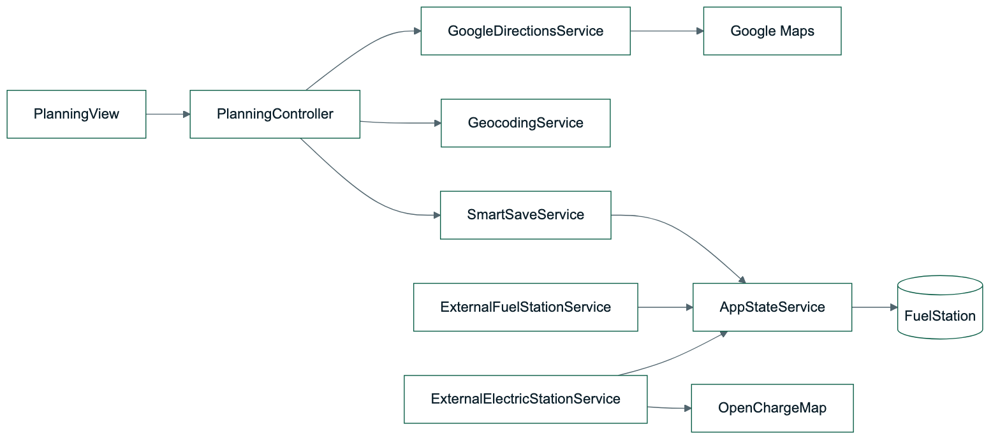
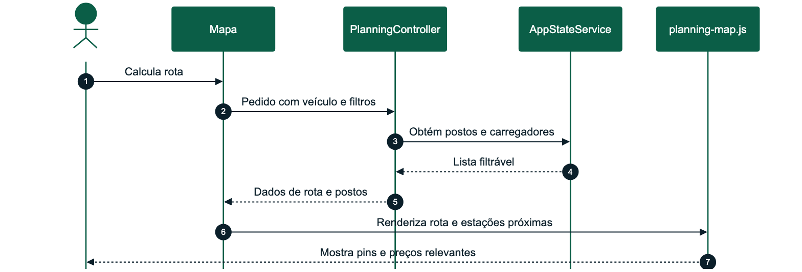

# OptiDrive - Desenho Detalhado Sprint 2

| Campo | Valor |
| --- | --- |
| Sprint | Sprint 2 |
| Tema | Mapas, postos, carregadores e rotas |
| Período | 21/05/2026 a 30/05/2026 |
| Estado | Concluído |
| Módulos | M03 Planeamento Inteligente, M04 Postos e Energia |

## Versões do Trabalho

| Versão | Data | Autor | Alterações |
| --- | --- | --- | --- |
| 1.0 | 21/05/2026 | Alexandre Miguel | Definição da sprint de planeamento, mapas e postos |
| 1.1 | 30/05/2026 | Alexandre Miguel | Inclusão de OpenChargeMap, filtros e postos próximos da rota |
| 1.2 | 24/06/2026 | Alexandre Miguel | Revisão estrutural segundo templates académicos: cobertura de testes e limitações controladas |

## Sumário Executivo

A Sprint 2 transformou o OptiDrive num cockpit de planeamento real. Foram integrados mapa, geocoding, cálculo de rotas, instruções, postos de combustível, carregadores elétricos, filtros por combustível/marca e apresentação de postos relevantes no contexto da rota.

## 1. Requisitos Funcionais Implementados

| Requisito | Descrição | Estado |
| --- | --- | --- |
| RF-M03-01 | O sistema deverá permitir planear uma rota com origem e destino escritos | Implementado |
| RF-M03-02 | O sistema deverá permitir pontos intermédios opcionais | Implementado |
| RF-M03-03 | O sistema deverá usar Google Maps quando configurado | Implementado |
| RF-M03-04 | O sistema deverá recalcular rota evitando portagens | Implementado |
| RF-M03-05 | O sistema deverá apresentar distância, duração, custo e instruções | Implementado |
| RF-M04-01 | O sistema deverá consultar e apresentar postos de combustível | Implementado |
| RF-M04-03 | O sistema deverá apresentar carregadores elétricos | Implementado |
| RF-M04-04 | O sistema deverá filtrar postos por energia compatível | Implementado |
| RF-M04-05 | O sistema deverá filtrar postos por marca | Implementado |
| RF-M04-06 | O sistema deverá apresentar postos próximos da rota | Implementado |

## 2. Componentes Técnicos

| Componente | Ficheiros principais | Responsabilidade |
| --- | --- | --- |
| Planeamento | `PlanningController`, `GoogleDirectionsService` | Cálculo e apresentação de rotas |
| Geocoding | `GeocodingService` | Converter moradas em coordenadas |
| Postos | `ExternalFuelStationService` | Sincronizar postos e preços |
| Carregadores | `ExternalElectricStationService` | Integrar OpenChargeMap |
| Mapa | `planning-map.js` | Renderizar rota, pins filtrados e instruções |

## 3. Diagrama de Componentes



_Figura 3 - Diagrama de Componentes_

## 4. Processo: Consultar Postos na Rota



_Figura 4 - Processo - Consultar Postos na Rota_

## 5. Interface Implementada

| Área | Comportamento |
| --- | --- |
| Origem/destino | Campos livres preparados para Google Places/Geocoding |
| Pontos intermédios | Campo opcional e não bloqueante |
| Mapa | Rota visual, postos, carregadores e fallback quando API não está disponível |
| Filtros | Tipo de energia, marca e proximidade à rota |
| Itinerário | Instruções de condução, distância e duração |

## 6. Requisitos Previstos Não Implementados

| Requisito | Decisão | Justificação |
| --- | --- | --- |
| Cálculo real de portagens pago por API externa | Parcial/fallback | A API pública de portagens não estava disponível; o Google Directions é usado para evitar portagens e o custo usa estimativa controlada |
| Cobertura total de combustíveis por todos os postos | Parcial com normalização | Os dados externos nem sempre indicam todos os combustíveis; o sistema normaliza tipos e mantém filtros por energia compatível |
| Places Autocomplete com conta de produção | Configurável por chave Google | O código está preparado para Google Maps; a ativação depende das APIs e billing/quotas da conta |

## 7. Testes

| Caso | Procedimento | Resultado esperado |
| --- | --- | --- |
| TI-01 | Calcular rota sem pontos intermédios | Rota calculada sem erro |
| TI-02 | Calcular rota com evitar portagens | Pedido enviado com opção de evitar tolls |
| TI-03 | Filtrar por combustível do veículo | Só aparecem postos compatíveis |
| TI-04 | Selecionar elétrico | Carregadores entram no mapa e Smart Save |
| TI-05 | Filtrar por marca | Lista/pins reduzem para marca selecionada |

### 7.1 Cobertura de Testes da Sprint

| Tipo de teste | Cobertura | Resultado |
| --- | --- | --- |
| Unitários | Cálculos de rota e normalização de combustível | Passou |
| Integração | Google Maps configurável, OpenChargeMap e serviços internos | Passou |
| Regressão | Pontos intermédios opcionais e filtros sem bloquear rota | Passou |
| Integração 3rd party | Google Directions/Geocoding e OpenChargeMap com fallback | Passou com dependência de chave |
| Sistema | Planeamento completo com veículo selecionado | Passou |
| Eficiência | Redução de pins para postos próximos da rota | Passou |
| Compatibilidade | Funcionamento com e sem APIs externas configuradas | Passou |
| Aceitação | Rota visível, postos filtráveis e instruções apresentadas | Passou |

## 8. Manual de Utilização da Sprint

1. Aceder a Planeamento.
2. Selecionar veículo.
3. Introduzir origem e destino.
4. Ativar ou não evitar portagens.
5. Calcular rota.
6. Filtrar postos por combustível ou marca.
7. Guardar rota para aplicar depois ao veículo.

## 9. Manual Técnico da Sprint

Configuração relevante:

```text
GoogleMaps:ApiKey
OpenChargeMap:ApiKey
```

Em Docker, as mesmas chaves são fornecidas por `.env` através de `GOOGLE_MAPS_API_KEY` e `OPEN_CHARGE_MAP_API_KEY`.
