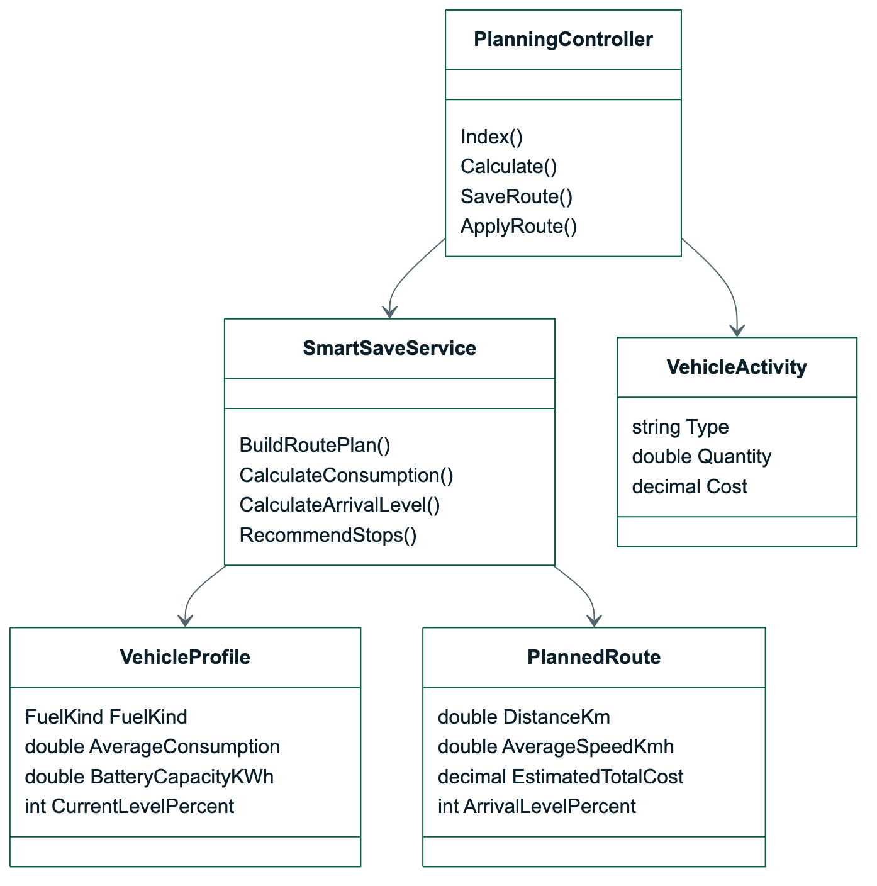
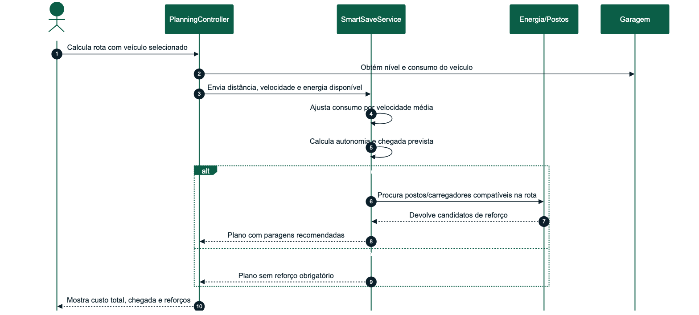
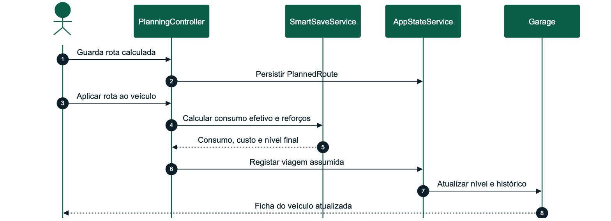

# OptiDrive - Desenho Detalhado Sprint 3

| Campo | Valor |
| --- | --- |
| Sprint | Sprint 3 |
| Tema | Smart Save, autonomia e histórico operacional |
| Período | 01/06/2026 a 08/06/2026 |
| Estado | Concluído |
| Módulos | M05 Otimização Smart Save, M02 Garagem e Veículos, M04 Postos e Energia |

## Versões do Trabalho

| Versão | Data | Autor | Alterações |
| --- | --- | --- | --- |
| 1.0 | 01/06/2026 | Alexandre Miguel | Definição da sprint de otimização de consumo e autonomia |
| 1.1 | 08/06/2026 | Alexandre Miguel | Inclusão de reforços, chegada com reserva e aplicação da viagem ao veículo |
| 1.2 | 24/06/2026 | Alexandre Miguel | Revisão estrutural segundo templates académicos e consolidação em plano de 5 sprints |

## Sumário Executivo

A Sprint 3 transformou o planeamento de rotas numa ferramenta de decisão inteligente. O foco deixou de ser apenas calcular distância e passou a ser responder a perguntas práticas: o veículo chega ao destino, quanto consome, que margem sobra, onde deve reforçar combustível ou carga, e como essa viagem afeta a garagem.

Nesta sprint foram implementados Smart Save, consumo ajustado por velocidade média, autonomia estimada, margem mínima de chegada, paragens de reforço e ligação direta entre rota guardada e histórico do veículo.

## 1. Requisitos Funcionais Implementados

| Requisito | Descrição | Estado |
| --- | --- | --- |
| RF-M05-01 | O sistema deverá estimar consumo por veículo | Implementado |
| RF-M05-02 | O sistema deverá ajustar consumo pela velocidade média | Implementado |
| RF-M05-03 | O sistema deverá calcular suficiência de autonomia | Implementado |
| RF-M05-04 | O sistema deverá sugerir reforços | Implementado |
| RF-M05-05 | O sistema deverá garantir margem mínima de chegada | Implementado |
| RF-M05-06 | O sistema deverá comparar custo rápido e económico | Implementado |
| RF-M02-03 | O sistema deverá guardar nível atual de combustível/carga | Implementado |
| RF-M02-04 | O sistema deverá permitir registar abastecimentos e carregamentos | Implementado |
| RF-M02-05 | O sistema deverá refletir viagens assumidas no nível do veículo e no histórico | Implementado |
| RF-M04-04 | O sistema deverá filtrar postos por energia compatível | Implementado |
| RF-M04-06 | O sistema deverá apresentar postos próximos da rota | Implementado |

## 2. Componentes Técnicos

| Componente | Ficheiros principais | Responsabilidade |
| --- | --- | --- |
| Smart Save | `SmartSaveService` | Consumo, autonomia, reserva e reforços |
| Planeamento | `PlanningController` | Orquestrar rota, veículo, postos e plano final |
| Garagem | `GarageController`, `VehicleActivity` | Refletir viagens e reforços no histórico |
| Energia | `FuelStation`, `ExternalElectricStationService` | Disponibilizar postos compatíveis para reforço |
| UI de rota | `planning-map.js`, views de Planeamento | Mostrar custo total, chegada prevista, paragens e itinerário |

## 3. Diagrama de Classes Detalhado



_Figura 3 - Diagrama de Classes Detalhado_

## 4. Processo: Calcular Smart Save



_Figura 4 - Processo - Calcular Smart Save_

## 5. Processo: Aplicar Rota ao Veículo



_Figura 5 - Processo - Aplicar Rota ao Veículo_

## 6. Interface Implementada

| Área | Melhorias da sprint |
| --- | --- |
| Planeamento | Chegada com reserva, consumo ajustado, custo total e Smart Save |
| Reforços | Postos de combustível ou carregadores sugeridos a meio da viagem |
| Garagem | Botão para aplicar viagem, nível atualizado e histórico de utilização |
| Postos | Filtros por energia compatível com o veículo selecionado |
| Itinerário | Instruções continuam visíveis, mas associadas ao custo e autonomia |

## 7. Requisitos Previstos Não Implementados

| Requisito | Decisão | Justificação |
| --- | --- | --- |
| Cálculo oficial de portagens por concessionária | Mantido como estimativa/fallback | Não foi identificada API pública estável para todas as portagens; a rota usa Google para evitar portagens |
| Consumo importado automaticamente por todos os modelos | Parcial/manual | As APIs abertas de veículos não garantem consumo real por versão; o consumo é editável e realista |
| Otimização multiobjetivo avançada | Simplificada | Para a entrega académica, a comparação rápido/económico e reforços já cobre o objetivo principal |

## 8. Testes

### 8.1 Testes Unitários

| Caso | Procedimento | Resultado esperado |
| --- | --- | --- |
| TU-10 | Calcular consumo por velocidade | Consumo aumenta em velocidades elevadas |
| TU-11 | Calcular EV sem autonomia suficiente | Recomenda carregamento |
| TU-12 | Aplicar viagem a veículo | Nível desce e histórico é criado |
| TU-13 | Calcular chegada com reforço | Nível final fica acima da margem mínima |
| TU-14 | Filtrar por energia compatível | Postos incompatíveis não dominam o plano |

### 8.2 Cobertura de Testes da Sprint

| Tipo de teste | Cobertura | Resultado |
| --- | --- | --- |
| Unitários | Smart Save, consumo por velocidade, autonomia e histórico | Passou |
| Integração | Planeamento, garagem, postos e carregadores | Passou |
| Regressão | Guardar/aplicar rota sem quebrar garagem | Passou |
| Sistema | Fluxo completo veículo -> rota -> reforço -> histórico | Passou |
| Eficiência | Postos filtrados por proximidade e energia | Passou |
| Aceitação | Produto calcula rota sem chegada artificial a 0% | Passou |

## 9. Manual de Utilização da Sprint

1. Entrar na conta.
2. Confirmar veículo na garagem.
3. Abrir Planeamento.
4. Selecionar veículo e velocidade média.
5. Calcular rota.
6. Validar consumo, custo, chegada e reforços.
7. Guardar rota.
8. Aplicar rota ao veículo.
9. Confirmar histórico e novo nível na garagem.

## 10. Manual Técnico da Sprint

```bash
dotnet test OptiDrive.sln
```

Componentes de configuração relevantes:

```text
GoogleMaps:ApiKey
OpenChargeMap:ApiKey
```
