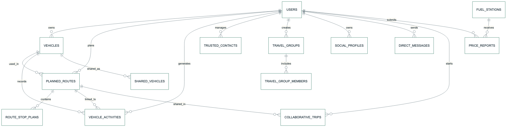

# OptiDrive - Modelacao de Dados e Scripts SQL

Estado do documento: versão final de apoio ao fecho de `OP-5`, `OP-6` e `OP-7`.

## 1. Objetivo

Este documento descreve a modelacao relacional do OptiDrive, derivada diretamente dos modelos de dominio atualmente implementados na aplicacao `OptiDrive.Web`. A aplicacao ja usa `EF Core + SQLite` como LocalDB em MacBook e como base persistente em Docker, mantendo estes scripts como referencia academica e tecnica.

## 2. Artefactos produzidos

Foram preparados os seguintes ficheiros em `/Users/alexandremiguel/Documents/Documents - MacBook Pro de Alexandre/GitRepositorios/OptiDrive/database`:

- `/Users/alexandremiguel/Documents/Documents - MacBook Pro de Alexandre/GitRepositorios/OptiDrive/database/optidrive_schema.sql`
- `/Users/alexandremiguel/Documents/Documents - MacBook Pro de Alexandre/GitRepositorios/OptiDrive/database/optidrive_bootstrap.sql`
- `/Users/alexandremiguel/Documents/Documents - MacBook Pro de Alexandre/GitRepositorios/OptiDrive/database/optidrive_views.sql`
- `/Users/alexandremiguel/Documents/Documents - MacBook Pro de Alexandre/GitRepositorios/OptiDrive/database/README.md`

## 3. Entidades principais

### 3.1 Utilizadores e acesso

- `users`
  - contas da plataforma
  - papel `User` ou `Admin`
- `social_profiles`
  - identidade social, cidade, bio, estilo de condução e preferências de partilha

### 3.2 Garagem

- `vehicles`
  - dados tecnicos do veiculo
  - combustivel, classe de portagem, consumo, autonomia e manutencao
- `vehicle_activities`
  - historico de criacao, update, abastecimento, carga e viagem aplicada

### 3.3 Postos e precos

- `fuel_stations`
  - postos liquidos e eletricos numa tabela unificada
  - combustivel principal, resumo de precos e metadados operacionais
- `price_reports`
  - divergencias de preco reportadas pela comunidade
- `api_sync_statuses`
  - estado das integracoes externas

### 3.4 Rotas e planeamento

- `planned_routes`
  - cabecalho da viagem planeada
- `route_stop_plans`
  - paragens sugeridas pelo Smart Save por sequencia

### 3.5 Colaboracao

- `trusted_contacts`
- `shared_vehicles`
- `travel_groups`
- `travel_group_members`
- `direct_messages`
- `collaborative_trips`

### 3.6 Deploy e persistencia local

- Local MacBook: `OptiDrive.Web/App_Data/optidrive.db`
- Docker: `./data/optidrive.db` montado para `/app/data/optidrive.db`

## 4. Relacoes principais

_Figura 4 - Relacoes principais_

## 5. Decisoes de modelacao

### 5.1 Unificacao dos postos

Em vez de separar postos de combustivel e carregadores em tabelas distintas, o modelo usa `fuel_stations` como entidade comum. A diferenciacao e feita por:

- `primary_fuel_kind`
- `available_fuel_kinds`
- `is_electric_charging`
- `fuel_price_map_json`

Esta opcao mantem o alinhamento com a API interna e com o comportamento do mapa.

### 5.2 Rotas e paragens

A tabela `planned_routes` guarda o resumo da viagem e tambem um `snapshot` JSON do caminho e das paragens. Em paralelo, a tabela `route_stop_plans` materializa as paragens do Smart Save de forma relacional, para permitir reporting, consultas SQL e futuras dashboards.

### 5.3 Historico operacional do veiculo

A tabela `vehicle_activities` foi desenhada para servir de trilho cronologico unico da garagem. Nela cabem:

- criacao do veiculo
- edicoes da ficha
- abastecimentos
- carregamentos
- viagens assumidas

## 6. Integridade e restricoes

O esquema inclui:

- `foreign keys` com cascatas adequadas
- `check constraints` para enums e limites numericos
- indice unico para garantir um unico veiculo predefinido por utilizador
- indices de apoio a consultas por local, marca, dono e cronologia

## 7. Bootstraps preparados

O dados iniciais replicam a apresentacao funcional do sistema, incluindo:

- utilizador apresentacao, admin e utilizador adicional
- viatura diesel e viatura eletrica
- postos e carregadores representativos
- uma rota base Setubal -> Faro
- historico de atividades
- contacto, partilha, grupo e reporte de preco

## 8. Vistas preparadas

Foram criadas vistas SQL de apoio:

- `vw_vehicle_garage_summary`
- `vw_vehicle_activity_timeline`
- `vw_route_execution_summary`
- `vw_station_price_overview`

Estas vistas ajudam na futura criacao de dashboards, relatorios e graficos.

## 9. Implementacao LocalDB e Docker

Foi adicionado o contexto `OptiDriveDbContext` com `EF Core + SQLite`. A aplicacao cria automaticamente a base de dados local no arranque e persiste utilizadores, garagem, rotas, postos, historico e dados sociais.

Artefactos principais:

- `OptiDrive.Web/Data/OptiDriveDbContext.cs`
- `Dockerfile`
- `docker-compose.yml`
- `OptiDrive.Web/appsettings.Docker.json`

## 10. Validacao realizada

Os scripts foram validados localmente atraves de execucao em `sqlite3` via Python, confirmando a criacao das tabelas, insercao dos bootstraps e leitura das vistas sem erro. A implementacao EF Core foi validada por build, testes automatizados e execucao Docker.

## 11. Conclusao

A modelacao preparada e consistente com o dominio atual do OptiDrive e fecha o gap principal entre produto inicial e persistencia local. A solucao fica pronta para apresentacao no MacBook, para execucao em Docker e para evolucao futura para PostgreSQL ou SQL Server caso seja necessario.
