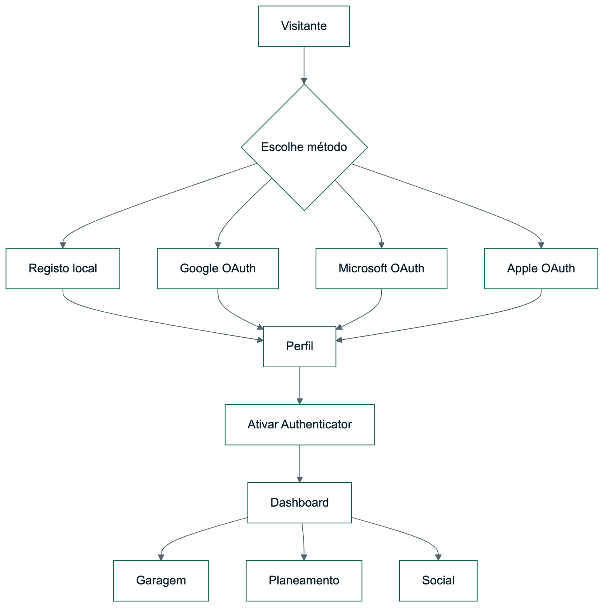

# OptiDrive - Autenticação Online e Social de Produto

| Campo | Valor |
| --- | --- |
| Documento | Relatório complementar de autenticação e social |
| Versão | 2.0 |
| Data | 24/06/2026 |
| Estado | Pronto para publicação |
| Âmbito | Login local, OAuth, MFA, perfis e colaboração |

## 1. Objetivo

Este relatório documenta a evolução do OptiDrive para uma experiência de produto real, com contas persistentes, autenticação federada configurável, Authenticator, perfil social, mensagens e viagens colaborativas.

## 2. Autenticação e Identidade

### 2.1 Login Local

| Elemento | Implementação |
| --- | --- |
| Registo | Nome, email e palavra-passe |
| Hashing | PBKDF2 via `PasswordSecurityService` |
| Sessão | Cookie + Session ASP.NET Core |
| Lockout | Controlo de tentativas falhadas no modelo de utilizador |
| Onboarding | Após criar conta, o utilizador é encaminhado para o perfil para ativar Authenticator |

### 2.2 OAuth Externo

O OptiDrive suporta fornecedores externos de identidade sem guardar credenciais no código. Os botões só aparecem quando o respetivo provider está configurado.

| Provider | Callback | Configuração |
| --- | --- | --- |
| Google OAuth | `/signin-google` | `Authentication:Google:ClientId` e `ClientSecret` |
| Microsoft OAuth | `/signin-microsoft` | Configurado por `Authentication:Microsoft:ClientId` e `ClientSecret` via `.env` |
| Apple OAuth | `/signin-apple` | Página de indisponibilidade neste ambiente, com integração técnica preparada |

Em Docker, a configuração passa por `.env`:

```text
GOOGLE_OAUTH_CLIENT_ID
GOOGLE_OAUTH_CLIENT_SECRET
MICROSOFT_OAUTH_CLIENT_ID
MICROSOFT_OAUTH_CLIENT_SECRET
APPLE_OAUTH_CLIENT_ID
APPLE_OAUTH_CLIENT_SECRET
APPLE_OAUTH_TEAM_ID
APPLE_OAUTH_KEY_ID
APPLE_OAUTH_PRIVATE_KEY_PATH
```

### 2.3 Apple OAuth

A integração Apple foi adicionada com `AspNet.Security.OAuth.Apple`. Existem duas formas de ativação:

| Modo | Variáveis |
| --- | --- |
| Client secret gerado manualmente | `APPLE_OAUTH_CLIENT_ID`, `APPLE_OAUTH_CLIENT_SECRET` |
| Client secret gerado pela app | `APPLE_OAUTH_CLIENT_ID`, `APPLE_OAUTH_TEAM_ID`, `APPLE_OAUTH_KEY_ID`, `APPLE_OAUTH_PRIVATE_KEY_PATH` |

Esta abordagem permite assumir honestamente que o Apple depende de Apple Developer/HTTPS, sem quebrar o fluxo de apresentação: o botão existe e encaminha para uma página explicativa profissional.

### 2.4 MFA Authenticator

| Capacidade | Estado |
| --- | --- |
| Geração de segredo TOTP | Implementado |
| QR code para apps Authenticator | Implementado |
| Validação de código de 6 dígitos | Implementado |
| Recovery codes | Implementado |
| Reset/desativação de Authenticator | Implementado |

A solução é compatível com Microsoft Authenticator, Google Authenticator e apps TOTP equivalentes.

## 3. Perfil de Utilizador

O perfil concentra estado de conta e segurança:

| Informação | Apresentação |
| --- | --- |
| Provider atual | Local, Google, Microsoft ou Apple |
| Providers associados | Campo `LinkedProviders` |
| Estado do email | Confirmado/por confirmar |
| Estado OAuth | Google, Microsoft e Apple ativos ou pendentes |
| Estado 2FA | Ligado/recomendado |
| Recovery codes | Contagem disponível |

## 4. Social Online

A parte social foi reforçada para ser valorizada como componente central do produto, não apenas acessório.

| Funcionalidade | Descrição |
| --- | --- |
| Perfil social | Nome público, bio, cidade, estilo de condução e preferências |
| Contactos de confiança | Rede de utilizadores para viagens e partilhas |
| Mensagens diretas | Conversas persistidas entre contas reais |
| Viagens colaborativas | Criação de viagens com participantes, encontro e split |
| Estado de viagem | Agendada, ativa e concluída |
| Presença recente | Indicação de utilizadores online/ativos |

## 5. Fluxo de Conta Real



_Figura 5 - Fluxo de Conta Real_

## 6. Segurança

| Risco | Mitigação |
| --- | --- |
| Password em texto simples | Hash PBKDF2 e campo antigo limpo |
| Roubo de password | MFA TOTP recomendado |
| Perda de Authenticator | Recovery codes |
| Credenciais OAuth no repositório | Variáveis `.env`/ambiente |
| Provider não configurado | Botão escondido e readiness pendente |

## 7. Validação

| Validação | Evidência |
| --- | --- |
| Build | `dotnet build OptiDrive.sln` |
| Testes | `dotnet test OptiDrive.sln` |
| Docker | `docker compose up -d --build` |
| Health | `GET /health` inclui `googleOAuth`, `microsoftOAuth`, `appleOAuth` e `authenticatorMfa` |
| UI | Login/registo mostram providers apenas quando configurados |

## 8. Conclusão

O OptiDrive apresenta uma base de identidade suficientemente madura para uma apresentação de produto real: login local, OAuth configurável, Authenticator, perfil, social e viagens colaborativas integradas no fluxo principal.
