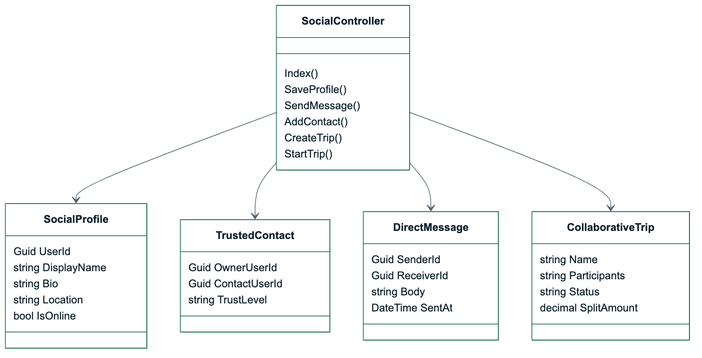
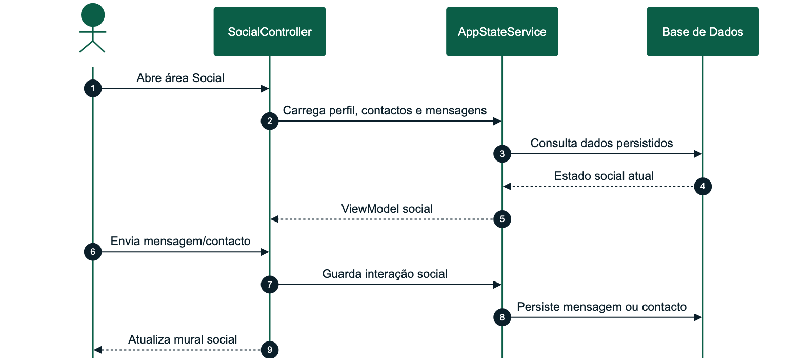
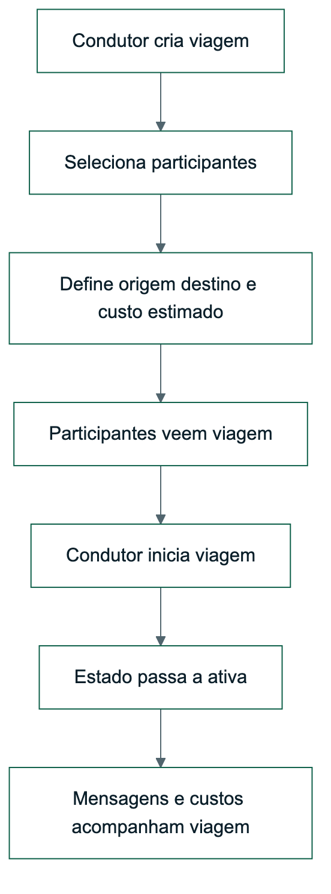

# OptiDrive - Desenho Detalhado Sprint 4

| Campo | Valor |
| --- | --- |
| Sprint | Sprint 4 |
| Tema | Social, OAuth e colaboração entre utilizadores |
| Período | 09/06/2026 a 16/06/2026 |
| Estado | Concluído |
| Módulos | M06 Social e Viagens Colaborativas, M01 Identidade e Segurança |

## Versões do Trabalho

| Versão | Data | Autor | Alterações |
| --- | --- | --- | --- |
| 1.0 | 09/06/2026 | Alexandre Miguel | Definição dos fluxos sociais e colaboração |
| 1.1 | 16/06/2026 | Alexandre Miguel | Inclusão de OAuth, MFA no perfil e viagens colaborativas |
| 1.2 | 24/06/2026 | Alexandre Miguel | Revisão final para coerência com plano de 5 sprints e templates académicos |

## Sumário Executivo

A Sprint 4 foi dedicada à dimensão social do OptiDrive, valorizada como diferencial do produto. O objetivo foi transformar a aplicação de um planeador individual para uma plataforma onde utilizadores têm perfil, contactos, mensagens e viagens colaborativas.

Também foram consolidados os mecanismos de autenticação externos, com Google e Microsoft configuráveis por `.env`, Apple apresentado como opção profissional indisponível neste ambiente, e Authenticator acessível no perfil.

## 1. Requisitos Funcionais Implementados

| Requisito | Descrição | Estado |
| --- | --- | --- |
| RF-M01-03 | O sistema deverá permitir iniciar sessão com Google OAuth quando configurado | Implementado |
| RF-M01-04 | O sistema deverá permitir iniciar sessão com Microsoft OAuth quando configurado | Implementado |
| RF-M01-05 | O sistema deverá permitir iniciar sessão com Apple OAuth quando configurado | Preparado/fallback |
| RF-M01-06 | O sistema deverá permitir ativar MFA TOTP | Implementado |
| RF-M06-01 | O sistema deverá permitir cada utilizador manter um perfil social | Implementado |
| RF-M06-02 | O sistema deverá permitir adicionar contactos de confiança | Implementado |
| RF-M06-03 | O sistema deverá permitir trocar mensagens diretas entre utilizadores | Implementado |
| RF-M06-04 | O sistema deverá permitir criar viagens colaborativas com participantes | Implementado |
| RF-M06-05 | O sistema deverá permitir iniciar viagens em conjunto e apresentar estado ativo | Implementado |
| RF-M06-06 | O sistema deverá permitir dividir custos entre participantes | Implementado |

## 2. Componentes Técnicos

| Componente | Ficheiros principais | Responsabilidade |
| --- | --- | --- |
| Social | `SocialController`, views `Social` | Perfis, contactos, mensagens e viagens |
| Identidade externa | `Program.cs`, `HomeController` | Google, Microsoft e Apple configurável/fallback |
| Perfil | `ProfileController`, views `Profile` | Estado da conta, MFA, provider e segurança |
| Estado | `AppStateService` | Persistência de mensagens, contactos e viagens |
| Domínio social | `SocialProfile`, `TrustedContact`, `DirectMessage`, `CollaborativeTrip` | Entidades sociais principais |

## 3. Diagrama de Classes Detalhado



_Figura 3 - Diagrama de Classes Detalhado_

## 4. Processo: Enviar Mensagem e Criar Ligação Social



_Figura 4 - Processo - Enviar Mensagem e Criar Ligação Social_

## 5. Processo: Viagem Colaborativa



_Figura 5 - Processo - Viagem Colaborativa_

## 6. Interface Implementada

| Área | Melhorias da sprint |
| --- | --- |
| Social | Aba dedicada apenas a perfil, contactos, mensagens e viagens |
| Perfil | Estado da conta, provider OAuth, Authenticator e recovery codes |
| Login | Botões Google, Microsoft e Apple com comportamento profissional |
| Viagens colaborativas | Criação, participantes, estado e split de custos |
| Dados realistas | Utilizadores e mensagens suficientes para apresentação credível |

## 7. Requisitos Previstos Não Implementados

| Requisito | Decisão | Justificação |
| --- | --- | --- |
| Chat em tempo real com WebSockets | Adiado para evolução com SignalR | As mensagens persistentes cobrem o fluxo demonstrável e reduzem risco antes da entrega |
| Apple Sign In real | Preparado com página de indisponibilidade | Exige Apple Developer Program, HTTPS público e configuração externa |
| Notificações push | Fora do âmbito da entrega atual | A entrega foca web MVC local/Docker sem infraestrutura push |

## 8. Testes

### 8.1 Testes Funcionais

| Caso | Procedimento | Resultado esperado |
| --- | --- | --- |
| TS-01 | Abrir Social com utilizador autenticado | Perfil e contactos aparecem |
| TS-02 | Enviar mensagem a contacto | Mensagem fica persistida |
| TS-03 | Criar viagem colaborativa | Viagem aparece com participantes |
| TS-04 | Iniciar viagem colaborativa | Estado passa para ativa |
| TS-05 | Abrir login com OAuth configurado | Google e Microsoft aparecem quando existem chaves |
| TS-06 | Clicar Apple sem configuração real | Página profissional de indisponibilidade é apresentada |

### 8.2 Cobertura de Testes da Sprint

| Tipo de teste | Cobertura | Resultado |
| --- | --- | --- |
| Unitários | Estados sociais e criação de viagens | Passou |
| Integração | SocialController, AppStateService e persistência | Passou |
| Regressão | Login local continua funcional após OAuth | Passou |
| Segurança | MFA, recovery codes e segredos fora do código | Passou |
| Aceitação | Social demonstra perfis, mensagens e viagens conjuntas | Passou |

## 9. Manual de Utilização da Sprint

1. Entrar no OptiDrive.
2. Aceder à aba Social.
3. Editar perfil social.
4. Ver contactos de confiança.
5. Enviar mensagem.
6. Criar viagem colaborativa.
7. Iniciar viagem e validar estado.
8. Abrir Perfil e confirmar Authenticator/OAuth.

## 10. Manual Técnico da Sprint

Variáveis externas usadas na sprint:

```text
GOOGLE_OAUTH_CLIENT_ID
GOOGLE_OAUTH_CLIENT_SECRET
MICROSOFT_OAUTH_CLIENT_ID
MICROSOFT_OAUTH_CLIENT_SECRET
APPLE_OAUTH_CLIENT_ID
APPLE_OAUTH_CLIENT_SECRET
```

O Apple real fica dependente de ambiente público compatível; em ambiente académico/local, a app apresenta fallback explícito e profissional.
