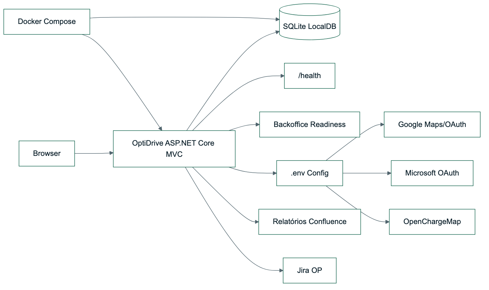
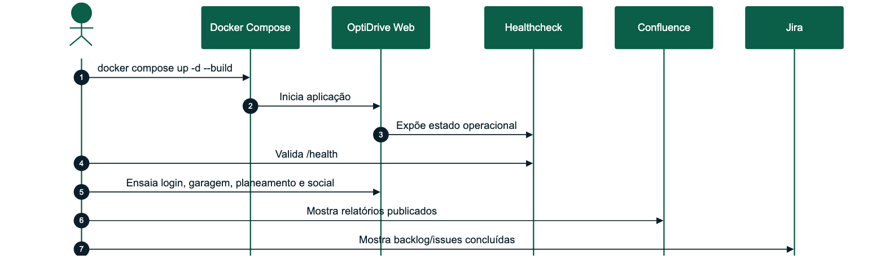

# OptiDrive - Desenho Detalhado Sprint 5

| Campo | Valor |
| --- | --- |
| Sprint | Sprint 5 |
| Tema | Readiness, i18n, Docker, dados realistas e entrega final |
| Período | 17/06/2026 a 30/06/2026 |
| Estado | Concluído |
| Módulos | M07 Administração e Observabilidade, todos os módulos consolidados |

## Versões do Trabalho

| Versão | Data | Autor | Alterações |
| --- | --- | --- | --- |
| 1.0 | 17/06/2026 | Alexandre Miguel | Definição da sprint de hardening e entrega |
| 1.1 | 21/06/2026 | Alexandre Miguel | Inclusão de Docker, LocalDB, healthcheck, tema e PT/EN |
| 1.2 | 24/06/2026 | Alexandre Miguel | Consolidação de relatórios, Jira, Confluence e dataset realista |
| 1.3 | 30/06/2026 | Alexandre Miguel | Correção de bugs finais, validação de fluxos críticos e preparação da entrega |

## Sumário Executivo

A Sprint 5 fechou o OptiDrive como produto apresentável: execução reproduzível por Docker, SQLite persistente, readiness operacional, tema claro/escuro, português/inglês, dataset realista, relatórios académicos completos, Jira atualizado, publicação em Confluence e correção final de bugs até 30/06/2026.

O foco desta sprint foi reduzir risco de apresentação. Em vez de acrescentar apenas novas funcionalidades, o objetivo foi garantir que o produto parece completo, consistente, navegável e defensável.

## 1. Requisitos Funcionais Implementados

| Requisito | Descrição | Estado |
| --- | --- | --- |
| RF-M07-01 | O sistema deverá disponibilizar backoffice com estado de integrações e sincronizações | Implementado |
| RF-M07-02 | O sistema deverá disponibilizar endpoint `/health` com estado operacional | Implementado |
| RF-M07-03 | O sistema deverá permitir alternar entre modo claro e modo escuro | Implementado |
| RF-M07-04 | O sistema deverá permitir alternar entre português e inglês | Implementado |
| RF-M07-05 | O sistema deverá executar em Docker com base de dados persistente | Implementado |
| RF-M02-06 | O sistema deverá apresentar ficha dedicada por veículo | Implementado |
| RF-M06-01 | O sistema deverá permitir perfil social realista | Implementado/reforçado |
| RF-M07-06 | O sistema deverá suportar validação final dos fluxos críticos antes da entrega | Implementado |

## 2. Componentes Técnicos

| Componente | Ficheiros principais | Responsabilidade |
| --- | --- | --- |
| Docker | `Dockerfile`, `docker-compose.yml`, `.dockerignore` | Execução reproduzível |
| Configuração | `.env.example`, `Program.cs`, `appsettings.*.json` | Chaves externas e ambientes |
| Persistência | SQLite, EF Core, `App_Data`/volume Docker | Dados locais duráveis |
| Readiness | `HealthController`, `AdminController` | Estado operacional e integrações |
| UI global | `site.css`, `site.js`, layout Razor | Tema claro/escuro, PT/EN e polish |
| Dados realistas | Bootstrap de dados | Utilizadores, veículos, mensagens e viagens |
| Documentação | `docs/reports`, `tools/confluence_publish.py`, `docs/jira` | Relatórios, Confluence e Jira |

## 3. Diagrama de Componentes



_Figura 3 - Diagrama de Componentes_

## 4. Processo: Preparar Apresentação Final



_Figura 4 - Processo - Preparar Apresentação Final_

## 5. Interface Implementada

| Área | Melhorias da sprint |
| --- | --- |
| Tema | Alternância claro/escuro persistente |
| Idioma | Alternância PT/EN nos textos principais |
| Readiness | Estado de Google Maps, OpenChargeMap, OAuth e base de dados |
| Garagem | Dados realistas para apresentação pública |
| Social | Conversas, contactos e viagens previamente povoadas |
| Documentação | Confluence com árvore de relatórios organizada |
| Jira | Issues documentais e técnicas ligadas à entrega |
| Bugfix final | Correções finais em autenticação, garagem, planeamento, social, i18n e apresentação |

## 6. Requisitos Previstos Não Implementados

| Requisito | Decisão | Justificação |
| --- | --- | --- |
| Deploy público cloud | Fora do âmbito da apresentação local | Docker em MacBook garante previsibilidade e evita dependência de hosting |
| Base de dados gerida em cloud | Substituída por SQLite persistente | A cadeira valoriza execução local e evidência técnica; SQLite é suficiente e reproduzível |
| Apple Sign In produtivo | Preparado/fallback | Requer Apple Developer Program e domínio HTTPS público |
| Pagamentos reais entre participantes | Fora do âmbito legal/técnico | O sistema calcula split, mas não processa transações financeiras reais |

## 7. Testes

### 7.1 Testes de Sistema

| Caso | Procedimento | Resultado esperado |
| --- | --- | --- |
| TF-01 | Executar `dotnet test OptiDrive.sln` | Testes passam |
| TF-02 | Executar `docker compose up -d --build` | Container fica ativo |
| TF-03 | Abrir `/health` | Estado Healthy com integrações reportadas |
| TF-04 | Entrar com conta local | Sessão abre |
| TF-05 | Abrir garagem | Veículos realistas aparecem |
| TF-06 | Calcular rota | Mapa/resumo/itinerário aparecem |
| TF-07 | Abrir social | Contactos, mensagens e viagens aparecem |
| TF-08 | Alternar tema e idioma | Preferências são aplicadas |

### 7.2 Cobertura de Testes da Sprint

| Tipo de teste | Cobertura | Resultado |
| --- | --- | --- |
| Build | Solução .NET completa | Passou |
| Unitários | Serviços de domínio e segurança | Passou |
| Sistema | Fluxo completo de apresentação | Passou |
| Integração | APIs configuráveis e healthcheck | Passou |
| Regressão | Garagem, planeamento e social após polish | Passou |
| Compatibilidade | Local e Docker em macOS | Passou |
| Aceitação | Produto pronto para defesa académica | Passou |

## 8. Manual de Utilização da Sprint

1. Executar Docker.
2. Abrir a aplicação.
3. Entrar com conta de apresentação.
4. Validar perfil e Authenticator.
5. Abrir garagem e veículo.
6. Calcular rota no planeamento.
7. Aplicar rota ao veículo.
8. Abrir Social e mostrar viagens colaborativas.
9. Abrir Backoffice/Health.
10. Mostrar Confluence e Jira.

## 9. Manual Técnico da Sprint

```bash
cp .env.example .env
docker compose up -d --build
curl http://127.0.0.1:5080/health
dotnet test OptiDrive.sln
```

Conta recomendada para apresentação:

```text
alexandre@optidrive.pt / opti2026
```
