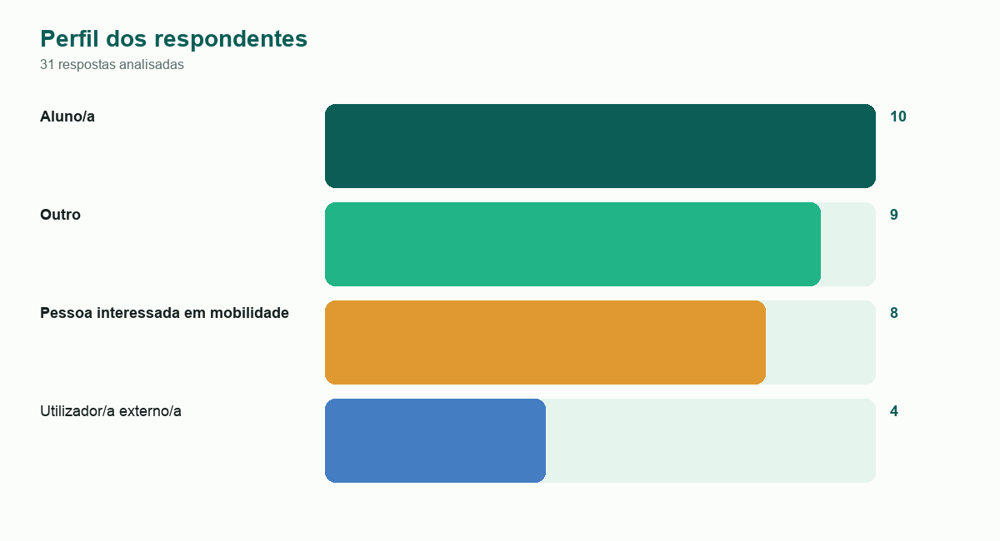
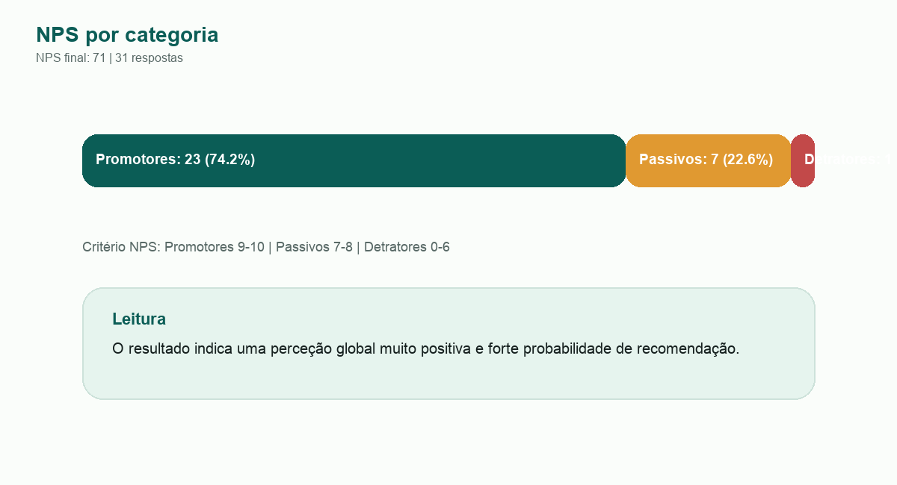
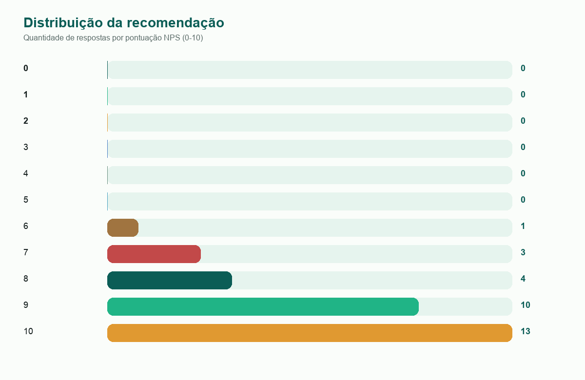
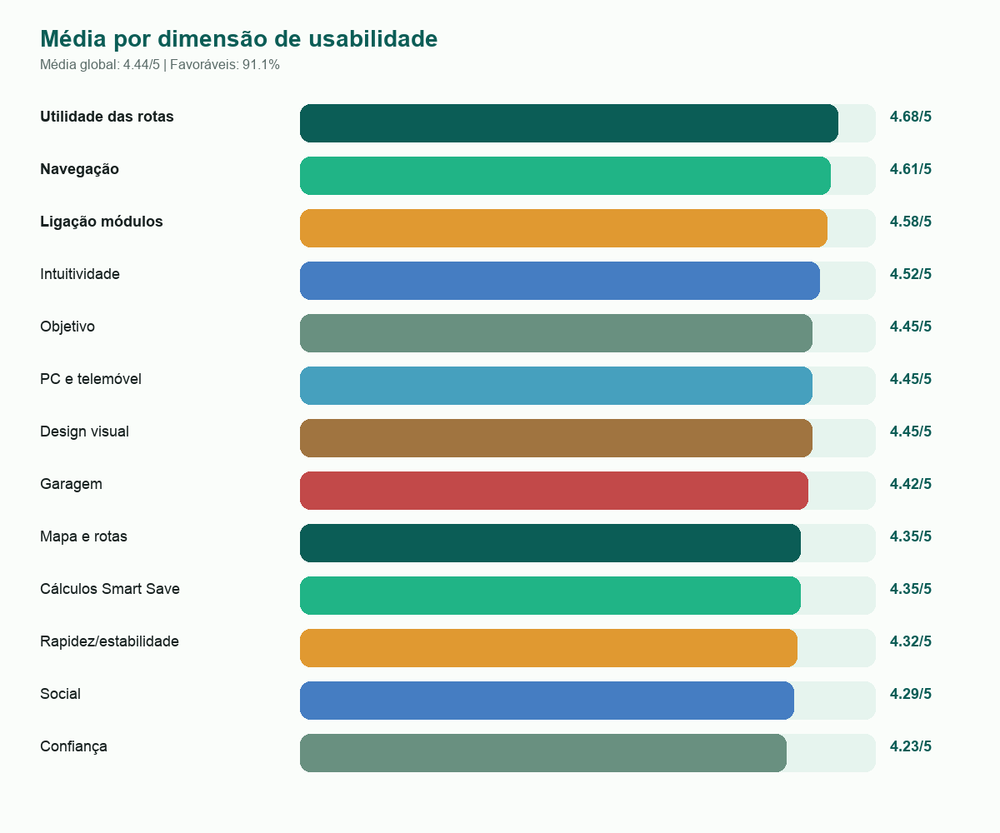
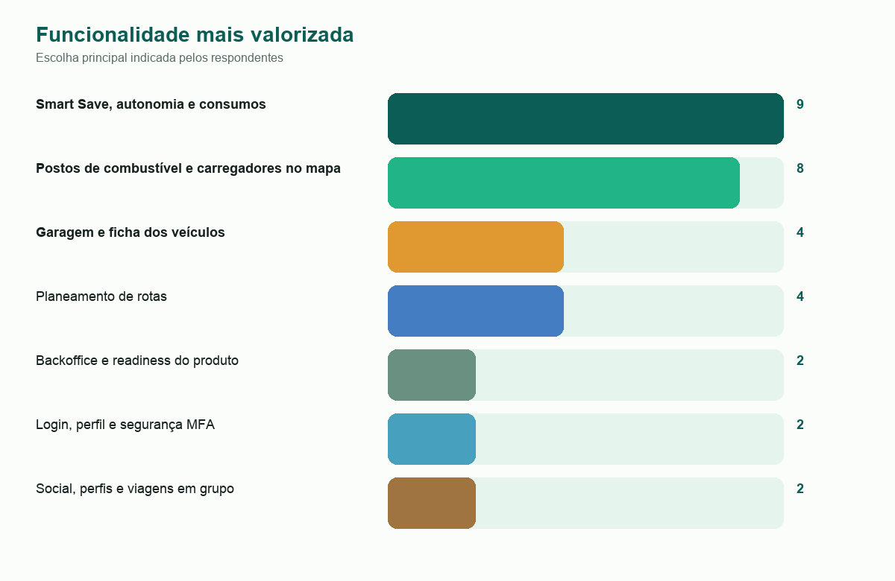
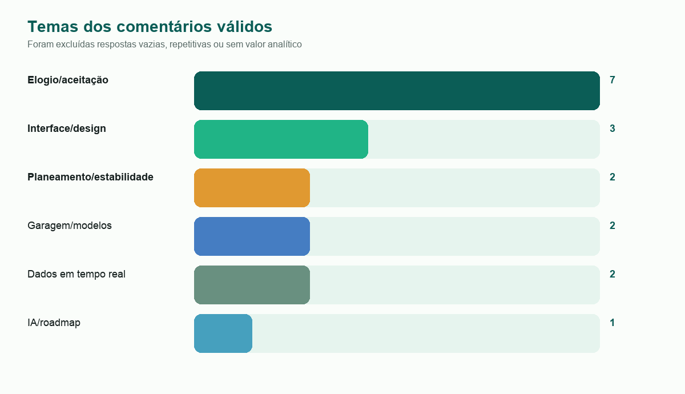

# OptiDrive - Avaliação de Usabilidade e NPS

| Campo | Valor |
| --- | --- |
| Projeto | OptiDrive |
| Instrumento | Google Forms - Questionário de Usabilidade OptiDrive |
| Data de análise | 06/07/2026 |
| Respostas analisadas | 31 |
| Estado | Concluído |

## 1. Objetivo

Este documento apresenta a análise das respostas recolhidas no questionário de usabilidade do OptiDrive. O objetivo foi avaliar a perceção dos utilizadores sobre intuitividade, clareza, design, utilidade, confiança, componente social e probabilidade de recomendação da aplicação.

O questionário incluiu perguntas fechadas em escala 1-5, uma pergunta NPS de 0-10, seleção da funcionalidade mais relevante e perguntas abertas para identificar melhorias e comentários qualitativos.

## 2. Amostra

Foram analisadas 31 respostas. A amostra inclui alunos, utilizadores externos, pessoas interessadas em mobilidade e outros perfis. A distribuição permite observar a perceção de pessoas com diferentes níveis de proximidade ao projeto.

*Figura 1 - Perfil dos respondentes*

## 3. Net Promoter Score

O NPS foi calculado com base na pergunta: "De 0 a 10, qual é a probabilidade de recomendar o OptiDrive a um colega ou amigo?".

| Categoria | Critério | Respostas | Percentagem |
| --- | --- | ---: | ---: |
| Promotores | 9-10 | 23 | 74.2% |
| Passivos | 7-8 | 7 | 22.6% |
| Detratores | 0-6 | 1 | 3.2% |
| NPS final | % Promotores - % Detratores | 71 | - |

O resultado obtido foi um NPS de 71, o que indica uma perceção global positiva e uma forte probabilidade de recomendação por parte dos respondentes.

*Figura 2 - NPS por categoria*

*Figura 3 - Distribuição da recomendação*

## 4. Métricas de Usabilidade

A média global das perguntas de escala 1-5 foi de 4.44/5. A percentagem global de respostas favoráveis, considerando valores 4 e 5, foi de 91.1%.

*Figura 4 - Média por dimensão de usabilidade*

### 4.1 Dimensões com melhor resultado

| Dimensão | Média | Respostas favoráveis |
| --- | ---: | ---: |
| Utilidade das rotas | 4.68/5 | 100.0% |
| Navegação | 4.61/5 | 96.8% |
| Ligação módulos | 4.58/5 | 96.8% |

### 4.2 Dimensões com maior margem de melhoria

| Dimensão | Média | Respostas favoráveis |
| --- | ---: | ---: |
| Confiança | 4.23/5 | 80.6% |
| Social | 4.29/5 | 83.9% |
| Rapidez/estabilidade | 4.32/5 | 90.3% |

## 5. Funcionalidades Mais Valorizadas

A funcionalidade mais referida foi "Smart Save, autonomia e consumos", seguida por postos/carregadores no mapa. Isto confirma que os respondentes reconheceram maior valor nas funcionalidades diretamente ligadas ao planeamento inteligente, autonomia, energia e decisão de viagem.

*Figura 5 - Funcionalidade mais relevante*

## 6. Comentários Abertos

As respostas abertas foram revistas manualmente. Foram excluídas da tabela qualitativa respostas vazias, repetitivas, pouco informativas ou com aparência de resposta pouco séria, como pontos isolados, "nada" sem contexto ou elogios demasiado genéricos. Essas respostas continuam incluídas nas métricas fechadas, mas não foram usadas como evidência qualitativa.

*Figura 6 - Temas principais dos comentários abertos*

| Tema | Comentário selecionado |
| --- | --- |
| Elogio visual | Foi valorizada a consistência visual ao longo do produto. |
| Produto claro | O OptiDrive foi descrito como um produto claro, simples e útil, com potencial de evolução. |
| Melhoria técnica | Foi sugerido melhorar a estabilidade do Planeamento, evitando recarregamentos que apagam a pesquisa. |
| Garagem | Foi apontada a necessidade de tornar alguns campos da Garagem mais claros e melhorar a cobertura de modelos/combustíveis. |
| Roadmap de planeamento | Foi sugerida a possibilidade de preencher dados da viatura diretamente no Planeador. |
| Roadmap EV | Foi sugerido apresentar tempos de chegada aos carregadores com dados em tempo real. |
| Roadmap inteligente | Foi sugerida uma assistente com IA para analisar hábitos de condução, prever manutenção e otimizar rotas. |
| Síntese positiva | A experiência geral foi considerada positiva, fácil de utilizar e alinhada com o objetivo do produto. |

## 7. Interpretação dos Resultados

Os resultados indicam que o OptiDrive foi percecionado como intuitivo, visualmente consistente e útil para planeamento de viagens. As respostas mostram especial valorização do Smart Save, dos consumos/autonomia e da presença de postos e carregadores no mapa.

As principais oportunidades de melhoria identificadas foram estabilidade no Planeamento, clareza de alguns campos da Garagem, expansão de dados de veículos e evolução para funcionalidades inteligentes, como sugestões baseadas em hábitos de condução.

## 8. Conclusão

A avaliação de usabilidade reforça que o OptiDrive apresenta uma base sólida enquanto produto académico funcional. O NPS positivo, a média global elevada nas escalas de usabilidade e os comentários qualitativos indicam boa aceitação do conceito, mantendo simultaneamente um conjunto claro de melhorias futuras para roadmap.
